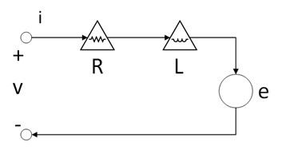
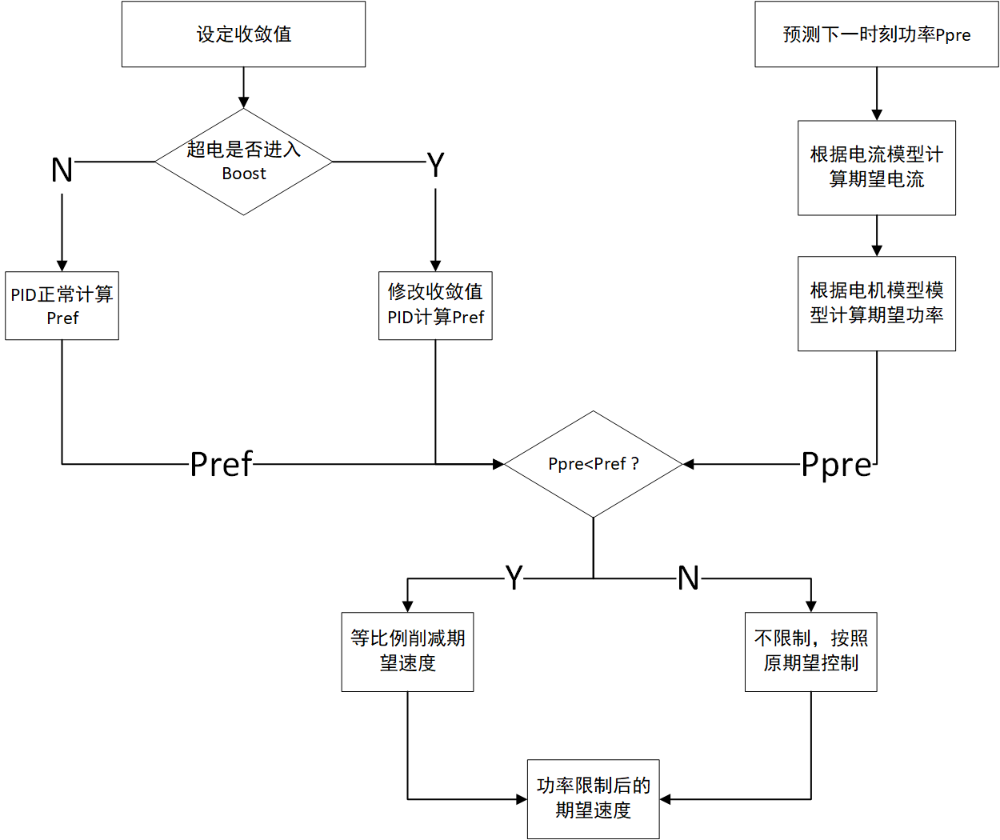

# 底盘功率限制

 


## 理论

RoboMaster 对抗赛相关规则针对步兵、英雄和哨兵三个兵种设置了底盘功率限制，机器人底盘需在功率限制范围内运行；裁判系统持续监控机器人底盘功率，对功率超限的机器人按一定规则进行惩罚。考虑到机器人在运动过程中难以准确控制瞬时输出功率，为避免因瞬时超功率导致的惩罚，规则设置了缓冲能量 Z。

> 更多描述请参考最新规则。

因此，底盘功率限制算法的目标是：在保证底盘运动可控的前提下，将底盘总功率（所有轮组叠加之和）限制在功率上限附近，并充分利用缓冲能量，实现底盘的平稳迅速启停、流畅运动，确保不受到底盘功率超限惩罚。

### 数据说明

对于机器人底盘，功率相关的数据来源有裁判系统、超级电容功率控制板量测和电机电调反馈，能够读取以下信息：

| 数据名       | 符号（单位）      | 数据源   | 频率（Hz） | 描述                                                         |
| ------------ | ----------------- | -------- | ---------- | ------------------------------------------------------------ |
| 底盘功率上限 | $P_m(\rm W)$      | 裁判系统 | 10         | 当前等级下该兵种的底盘功率上限（max），超限则首先扣除缓冲能量 |
| 底盘缓冲能量 | $Z(\rm J)$        | 裁判系统 | 10         | 缓冲能量余量，随裁判系统功率量测动态变化，若耗尽将导致超功率惩罚。目前（2024赛季）无增益上限为 60 J，触发飞坡增益后增加至 250 J 一次 |
| 底盘功率     | $P_{r}(\rm W)$    | 裁判系统 | 10         | 裁判系统（referee）测得的底盘总功率                          |
| 底盘功率     | $P_{c}(\rm W)$    | 超电主控 | 1000       | 超电主控（cap）测得的底盘总功率                              |
| 电机转速     | $\Omega(\rm rps)$ | 电调     | 1000       | 电机转速反馈                                                 |
| 电机转矩电流 | $i_q(\rm A)$      | 电调     | 1000       | 电机转矩电流反馈，手册未指明量纲，经测试与输入一致：C620 电调原始值范围 $[-16384,16384]$，线性映射到 $[-20,20] \rm A$. |

人为指定或计算得到以下数据，频率为 1KHz：

| 数据名             | 符号（单位）             | 描述                                                         |
| ------------------ | ------------------------ | ------------------------------------------------------------ |
| 底盘功率模型计算值 | $P_{model}(\rm W)$ | 根据功率模型计算得到的底盘功率 |
| 底盘功率估计       | $\hat P(\rm W)$          | 滤波后验估计结果                      |
| 底盘功率模型预测值 | $P_{pred}(\rm W)$       | 根据电机功率模型计算得到，预测（predict）下一控制周期的底盘功率 |
| 动态底盘功率上限 | $P_{ref}(\rm W)$ | 计算得到的动态变化、用于功率限制的底盘功率目标上限 |
| 底盘缓冲能量目标值 | $Z_{ref}(\rm J)$ | 缓冲能量目标值，用户给定 |
| 电机转速目标值     | $\Omega_{ref}(\rm  rps)$ | 电机转速目标值，用户给定                                     |
| 电机转矩电流目标值 | $i_{ref}(\rm A)$        | 电机转矩电流目标值，基于转速目标值由控制器计算得出。C620 电调原始值范围 $[-16384,16384]$，线性映射到 $[-20,20] \rm A$. |

### 电机功率模型

根据现有能够获取的数据，一个较为准确的电机功率模型为：

$$
P=\Omega\cdot M+P_{loss}
$$

其中 $M$ 表示输出转矩，$P_{loss}$ 表示除机械输出以外的功率损耗，主要为铜损耗。

考虑电磁转矩和转矩电流 $i_q$ 近似成正比（如下图，C620 电调搭配 M3508 电机速度闭环控制的电机性能曲线），定义转矩系数 $k_{M}$，有

$$
M = k_{M}\cdot i_q
$$


> 根据手册，转矩常数为 $0.3\  \rm N\cdot m/A$，可作为 $k_M$ 的初值参考。

使用转矩电流近似表示线电流，基于 $P_{loss} = R\cdot i^2$，在电机堵转的情况下统计 $i_q$ 和功率观测 $P_{measure}$ ，拟合损耗曲线。以 C620 电调 + M3508 电机为例，堵转电机，在 5000ms 内以 $[0:16384/2000:16384]$ 扫描转矩电流，$P-i$ 曲线拟合结果如下（供参考）：


其中 $\hat R=p_1$；$p_2$ 视为 0；$p_3$ 为电机所接入电路的静息功率。

#### 期望电流计算模型



直流无刷电机通过改变内部磁场分布，驱动电机转子转动。从电路模型角度分析，可以等效成一个永磁直流直流电机模型。

电机的电力学和动力学公式如下：
$$ {$$}
\begin{align}
u(t)&=Ri(t)+L\frac{\partial{i}(t)}{\partial{t}}+e \\ 
J_{TM}\dot{\omega}_M&=T_M-T_L 
\end{align}
$$ {$$}
其中，$u$为等效输入电压，$i$为电机等效电流，$L$为电枢电感，$R$为电机等效内阻，$e$为电磁电压,  $J_{TM}$为动力单元整体的转动惯量， $T_M$为电机产生的总扭矩， $T_L$为总的载荷扭矩， $\dot{\omega}_M$为电机的角加速度。

此外，电机扭矩和电机当前电流存在比例关系，电磁压力$e$与电机角速度也存在比例关系： 
$$
\begin{align} 
e&=K_E\omega_M\\ 
T_M&=K_Mi(t) 
\end{align}
$$
其中， $$K_M$$为电机机械常数， $$K_E$$为电机电力常数。

总载荷扭矩与电机系统的转动惯量和电机系统的角加速度关系为：
$$
\begin{align}
T_L=J_L\dot{\omega}_M+b_L\omega_M
\end{align}
$$
其中， $$ b_L$$ 为电机系统的摩擦系数。

综上，输入电压和电流、电流和电机转速的关系为：
$$
\begin{align} 
u\left(t\right)&=Ri\left(t\right)+L\dot{i}\left(t\right)+K_E\omega_M\\ 
i\left(t\right)&=\frac{J_{TM}+J_L}{K_M}\dot{\omega}_M+\frac{b_L}{K_M}\omega_M
\end{align}
$$
现令 $$K_1=K_E$$, $$K_2=\frac{J_{TM}+J_L}{K_M}$$, $$b=\frac{b_L}{K_M}$$,并对上式作拉普拉斯逆变换得到：
$$
\begin{align} 
U(s)&=(R+Ls)I(s) +K_1\Omega(s)\\ 
I(s)&=(K_2s+b)\Omega(s)
\end{align}
$$
则 $$U和I、I和\Omega$$间的传递函数为:
$$
\begin{align}
\frac{I(s)}{U(s)}&=\frac{K_2s+b}{LK_2s^2+(Lb+RK_2)s+Rb+K_1}\\ 
\frac{\Omega(s)}{I(s)}&=\frac{1}{K_2s+b}
\end{align}
$$
综上可将期望电流的计算模型抽象为：
$$
i_{ref_j}=k_{\Omega}\cdot\Omega_{ref_j}+k_a\cdot(\Omega_{ref_j}-\Omega_{j})
$$


#### 功率计算

考虑 C620 电调具有优良的转矩电流调控性能，认为实际转矩电流能够密切跟随给定的转矩电流目标值。而电机的转速是缓慢变化的过程，不能突变，1ms 控制周期内的变化忽略不计。给出电机目标转速后，使用下式预测一个控制周期（1ms）后单个电机的功率：

$$
P_{pred_j}= \hat k_{M}\cdot\Omega_j\cdot i_{ref_j}+\hat R\cdot i^2_{ref_j}
$$

对于底盘的全部电机以及底盘的静息功率 $P_0$，叠加以预测总功率：

$$
P_{pred}=\hat k_{M}\sum_j \Omega_j\cdot  i_{ref_j}+\sum_j \hat R \cdot i_{ref_j}^2+P_0
$$

### 功率限制

算法主要流程如下：



此外，注意以下特殊情况：

* 单个电机期望输出电流超限，需要按照电流上限解出其转速限制系数
* 当出现异常情况导致缓冲能量过低（超电电压过低）时，触发保护机制，应给出极低的目标功率
* 若出现裁判系统或超电主控断联，需做对应处理。

#### 计算动态功率上限

算法中额外计算动态底盘功率上限 $P_{ref}$ （而不直接使用 $P_m$ 作为上限），一是为了应对电机启动阶段瞬时功率较大的情况，此时功率限制应适当放宽，若以 $P_m$ 为实际功率上限将难以启动；二是为了充分利用部分缓冲能量。计算过程如下：

* 求取缓冲能量调节控制量 $u(Z)$，采用 $PD$ 控制以增加稳定性：

$$
\begin{align}
e(Z)=&Z_{ref}-Z\\
u(Z)=&K_{pz}e(Z)+K_{dz}{\Delta e(Z)\over T}
\end{align}
$$

* 参照裁判系统的缓冲能量计算逻辑 `Z = Z + (Pm - P)`，要使控制量 $u(Z)$ 生效，功率目标值应为：

$$
P_{ref}=P_m-u(Z)
$$

* 安全起见 $Z_{ref}$ 一般设置为 $20\rm J$ 左右。为充分利用缓冲能量，对于不同的 $P_m$ 应采用动态参数，比例系数的选取可参考下式：

$$
K_{pz}=\frac{P_m}{Z_{ref}}
$$

#### 求解转速削减系数

由功率预测模型，当预测出的底盘功率大于动态功率上限时，同比例削减各电机目标转速。设置削减系数 $k_l$，削减后电机 $\Omega_{ref}'=k_l\cdot\Omega_{ref}$ . 求取 $k_l$，使得

$$
\hat k_{M}\sum_j \Omega_j \cdot K_{p_j}( k_l \Omega_{ref_j}-\Omega_j)+
\sum_j 
\hat R \cdot [K_{p_j} (k_l\Omega_{ref_j}-\Omega_j)]^2
+P_0 \triangleq P_{ref}
\tag{1}
$$

记

$$
\begin{split}
\alpha = &  \hat R \sum_j  (K_{\Omega_j}^2   \Omega_{ref_j}^2+2K_{\Omega_j}K_{a_j}\Omega_{ref_j}^2+K_{a_j}^2\Omega_{ref_j})\\
\beta = &\sum_j \hat k_{M}(K_{\Omega_j}+K_{a_j})\Omega_{ref_j}^2 -  2\hat R(K_{\Omega_j}K_{a_j}+K_{a_j}^2)\Omega_{ref_j}\Omega_{j}\\
\gamma= &\sum_j \hat R K_{a_j}^2 \Omega_j^2- \hat k_{M}K_{a_j}\Omega_{ref_j}\Omega_{j}+P_0-P_{ref}\\
\end{split}
$$

若解存在（$\alpha\ne 0$且$$\beta^2-4\alpha\gamma\ge0$$），解得
$$
k_l=\frac{-\beta\pm\sqrt{\beta^2-4\alpha\gamma}}{2\alpha},取解\in (0,1)
$$

若出现解不存在的情况，求使得 $(1)$ 式左边结果最小的 $k_l$ 值，以尽可能地限制功率：
$$
k_l = -{\beta \over 2\alpha }
$$
若$\alpha= 0$，则方程不满足一元二次方程，降次为一元一次方程，解得：
$$
k_l = -{\gamma \over \beta }
$$
若$\alpha= 0$且$\beta= 0$，则方程不成立 ，令$k_l =0$

#### 连续性优化

在初始的算法测试中，发现由于解的不连续性会导致机器人运动过程中出现卡顿现象，故考虑对解进行连续性优化：

令待优化函数$$f$$有如下表达形式：
$$
f=a\cdot\sum_{N_{motor}}(\Omega^{act}_{ref_{j+1}}-\Omega^{act}_{ref_{j}})^2+b(k^{act}_{l_{j+1}}-k_{l_{j+1}})^2
$$
其中$\Omega^{act}_{ref_{j+1}}$表示下一时刻实际执行的期望转速，$\Omega^{act}_{ref_{j}}$表示上一时刻的执行期望转速，$k^{act}_{l_{j+1}}$表示下一时刻实际计算的削减系数，$k_{l_{j+1}}$表示当前时刻算法计算出的削减系数。

待优化函数$f$为实际执行速度与上一时刻执行速度的距离和实际的削减系数和计算出的削减系数的距离组合，优化此函数，期望函数变化率最小，以达到实际执行的速度与上一时刻尽可能连续的目标。

其中有：
$$
\Omega^{act}_{ref_{j+1}}=k^{act}_{l_{j+1}}\Omega_{ref_{j+1}}
$$
整理后有：
$$
f=a\cdot(k^{act}_{l_{j+1}}\Omega_{ref_{j+1}}-\Omega^{act}_{ref_{j}})^2+b(k^{act}_{l_{j+1}}-k_{l_{j+1}})^2
$$
$f$对$k^{act}_{l_{j+1}}$求导后，有如下结果：
$$
f'=a(\sum\Omega^2_{ref_{j+1}})k^{act}_{l_{j+1}}-a\sum\Omega^{act}_{ref_{j}}\Omega_{ref_{j+1}}+b(k^{act}_{l_{j+1}}-k_{l_{j+1}})=0
$$
整理上式后，得到：
$$
k^{act}_{l_{j+1}}=\frac{a\sum\Omega^{act}_{ref_{j}}\Omega_{ref_{j+1}}+bk_{l_{j+1}}}{a\sum\Omega^2_{ref_{j+1}}+b}
$$
为了便于参数控制, 令$a=1$,经过多种测试后，对于参数$b$的控制率有如下表达式：
$$
b = 15000 * (1 -k_{l_{j+1}})^2
$$
表明，当削减系数趋近于1时，功率限制算法趋向于速度平滑，当削减系数趋近于0时，采用的削减系数会快速靠近期望削减系数，从而抑制功率消耗。（测试环境为不断给车辆一个较大的阶跃期望速度，观察控制效果，经过测试在2024赛季全向轮上，任意时给出阶跃速度可将缓冲能量抑制在5$J$以上）

经实车测试证明，削减转速的整个控制过程均能达到降低功率的效果，并且能够以最大功率收敛控制能量。

## 参数调试方法与建议：

1.3.0版功率限制代码，其主要核心思想为通过预测下一时刻的功率$$P_{pre}$$与当前计算的动态功率上限$$P_ref$$进行比较求出适当的速度削减系数$$k_{l}$$,等比例削减轮速，从而达到功率限制的效果。

而预测功率的关键在于预测下一时刻的电流大小，本版本使用的电流模型为：
$$
i_{ref_j}=k_{\Omega}\cdot \Omega_{ref_j}+k_a\cdot(\Omega_{ref_j}-\Omega_{j})
$$
可将其预测过程抽象为仅有$$K_p$$的并联PID控制器，输入为轮期望转速以及期望加速度，输出为期望电流。

速度环控制系数$$k_{\Omega}$$主要控制速度达到平稳阶段，收敛能量与期望收敛能量的距离。（即当发现收敛能量比设定收敛能量高，可适当加大$$k_{\Omega}$$，反之则降低）

加速度环控制系数$$k_a$$主要控制轮子可用的瞬时加速度（车辆的加速爆发能力），$$k_a$$值越小，车辆爆发加速越高，同时消耗在加速上的能量也越多。$$\color{red}{对于此值，如过度减小，会导致加速过程中的功率难以控制，从而出现在加速过程中发生超功率现象，所以不建议过度减小此值。}$$

$$\color{red}{并且加速过程容易出现打滑现象，过大的加速度并不利于能量的有效使用。}$$

## 快速开始

组件源码仓库地址：<https://github.com/ZJU-HelloWorld/HW-Components>

底盘功率限制算法依赖于 PID 控制器, 并且在实际应用中对于轮电机的控制也使用PID控制器。

在项目中引用头文件：

```c++
#include "power_limiter.hpp"

namespace pwr_limiter = hello_world::power_limiter;
```

实例化一个底盘功率限制器，并初始化一个静态参数结构体数组，参数含义见组件说明。如：

```c++
pwr_limiter::PowerLimiter limiter_point = nullptr;
pwr_limiter::PowerLimiter limiter_ins;

PwrLimitStaticParams limiter_static_par = {
	  .z_ref_rfr = 20;            ///< 裁判系统功率控制下的缓冲能量收敛值
      .z_ref_cap = 20;            ///< 超级电容功率控制下的超电容量收敛值
      .z_danger = 5;              ///< 危险能量值，主要用于裁判系统功率控制
      .p_bias;                       ///< 底盘静息功率
      .pref_kd = 0;                  ///< 期望功率PID微分系数
      .pwr_permission_max = 800;  ///< 可用功率最大值，默认800w
};

//如有更多电机类型，如6020可继续添加
pwr_limiter::MotorStaticParamsList motor_static_par_list = {
     {
           .R = 0;                  ///< 电机铜阻
           .ka = 0;                 ///< 电机加速度系数
           .kv = 0;                 ///< 电机转速系数
           .km = 0;                 ///< 电机转矩系数
           .type = kMotor3508;  ///< 电机类型
      },
};
```

其中 `R`，`p_bias` 需要事先拟合、计算及整定。

初始化底盘功率限制器，如：

```c++
limiter_ins.Init(motor_static_par_list, limiter_static_par);
limit_point = new PowerLimiter(motor_static_par_list, limiter_static_par);
```

调用限制器时，首先设置动态参数数组，然后调用 `PwrLimitUpdateRuntimeParams` 方法进行数据更新，如：

```c++


struct PwrLimitRuntimeParams run_par = {
  .is_referee_online = true;          ///< 裁判系统是否在线, 不在线则使用最保守的功率限制方案
  .is_super_cap_online = true;        ///< 超级电容系统是否在线，不在线优先使用裁判系统下的功率限制
  .super_cap_mode = kPwrLimitSuperCapNormal;  ///< 超级电容系统工作模式
  .p_rfr_max = <REFEREE_DATA>;              ///< 裁判系统给出的最大功率限制
  .z_rfr_measure = <REFEREE_DATA>;          ///< 裁判系统测量的缓冲区能量
  .p_rfr_measure = <REFEREE_DATA>;             ///< 裁判系统测量的底盘功率
  .p_dummy_max = <REFEREE_DATA>;            ///< 裁判系统给出的最大功率限制，TODO 未来可以配合超电更改
  .z_dummy_measure = <CAP_DATA>;        ///< 超电剩余容量，用于超电在线下的功率限制
  .p_cap_measure = <CAP_DATA>;             ///< 超级电容测量的底盘功率
};

limiter_point->PwrLimitUpdateRuntimeParams(runtime_par);
```

然后计算限制后的各电机转速，存储于用户提供的数组中。

> 注意：最终得到的是与动态参数设置顺序对应的所有电机的目标转速，还需要自行使用控制算法得到目标转矩电流，再发送给电调。

```c++
float limited_spd_ref_radps[<WHEEL_NUM>];
hello_world::power_limiter::MotorRuntimeParams par[WHEEL_NUM];
    for (uint8_t i = 0; i < <WHEEL_NUM>; i++) {
      par[i].iq_measure = robot_chassis->chassis_motor_[i]->curr();
      par[i].spd_measure_radps = robot_chassis->chassis_motor_[i]->vel();
      par[i].spd_ref_radps = motor_ref_spd_radps[i];
      par[i].type = hello_world::power_limiter::kMotor3508;
    }
power_limiter::PowerLimiter::MotorRuntimeParamsList motor_run_par_list = {par[0], par[1], par[2], par[3]};
limiter_ins.PwrLimitCalcSpd(motor_run_par_list, limited_spd_ref_radps);
limiter_point->PwrLimitCalcSpd(motor_run_par_list, limited_spd_ref_radps);
```


## 附录

### 版本说明

| 版本号                                                       | 发布日期   | 说明                                                         | 贡献者                    |
| ------------------------------------------------------------ | ---------- | ------------------------------------------------------------ | ------------------------- |
|  | 2021.12.06 | 完成新版功率限制研发，采用简单模型                           | 薛东来                    |
|  | 2022.07.17 | 配合新超电逻辑联调，整理代码                                 | 薛东来                    |
|  | 2023.01.11 | 修改估计细节，完善模型                                       | 薛东来                    |
|  | 2023.05.17 | 1. 拟合曲线<br />2. 测试并修正电机输出电流超限问题以及km估计不准问题<br />3. 结合超电逻辑完善 | 薛东来 赵炜               |
|  | 2024.09.01 | 1.添加连续性优化<br />2.补充方程求解逻辑<br />3.更改期望电流计算方法<br />4.完善测试数字超电控制<br />5.测试舵轮与全向轮的功率限制效果 | 薛东来 杨舟 王彦程 蔡坤镇 |
