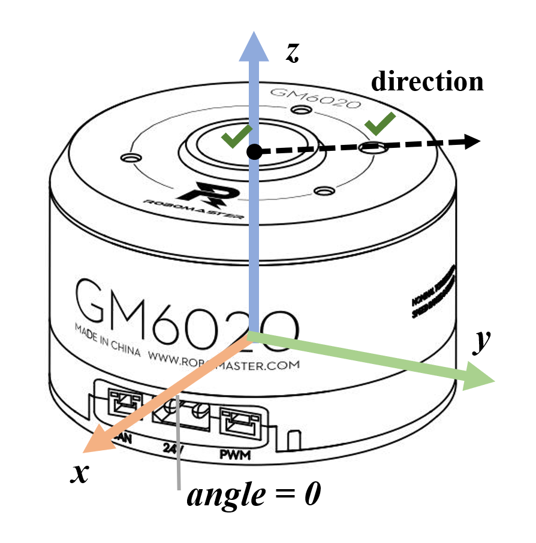
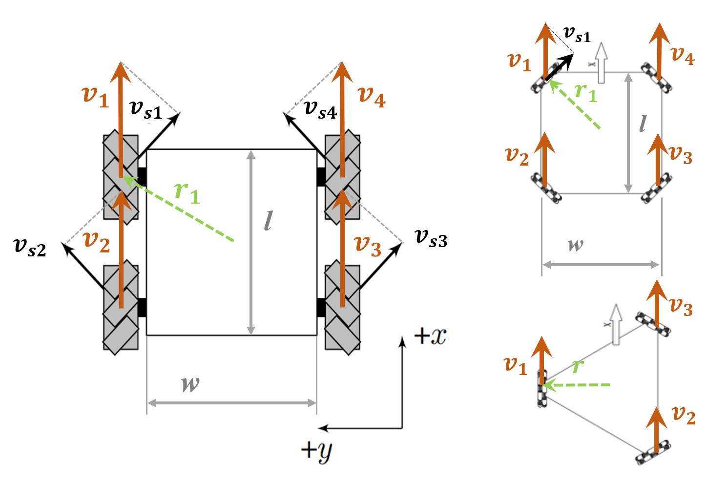

# 底盘逆运动学解算

  <sp> 

## 理论

根据给定的底盘 $x,y$ 方向上的目标平动速度分量和绕 $z$ 轴的目标旋转角速度分量，经逆运动学解算，能够得出：

* 四组航向电机的目标角度和对应的目标驱动轮速（舵轮）
* 四个目标驱动轮速（麦克纳姆轮 / 全向轮）
* 三个目标驱动轮速（全向轮）

完成逆运动学解算后，我们也可以对矩阵求（伪）逆以进行正运动学解算。


### 底盘驱动构型

#### 基本概念

* **驱动电机（driving motor）** 驱动底盘移动。目前型号为 M3508，反馈转子转速单位为 $\rm rpm$
* **航向电机（steering motor）** 在舵轮轮组中负责改变驱动轮朝向。目前（2022赛季）型号为 GM6020，编码器反馈机械转子刻度 0 ~ 8191，程序中线性映射到 $-\pi$ ~ $0$ ~ $\pi$；对其他型号的航向电机，可采用类似的映射
* 记**驱动轮直径**为 $d$，该值可由模型读出，单位：$\rm m$
* **轴距（wheelbase）** 即前后轮轴间距离，该值可由模型读出，记为 $l$，单位：$\rm m$
* **轮距（track）** 即左右驱动轮中心距离，该值可由模型读出，记为 $w$，单位：$\rm m$

#### 舵轮

舵轮轮组由一个驱动轮及一个能够改变其朝向的航向电机组成。为实现平台全向移动，舵轮底盘一般由4个轮组组成，或由两个主动轮组及两个从动轮组成。

#### 麦克纳姆轮

为实现平台全向移动，麦轮底盘一般由4个麦轮组成，其中左旋轮和右旋轮各2个，呈手性对称；麦轮的安装方式呈 X 或 O 型，一般采取 O 型安装。麦轮上的辊子轴线与轮毂轴线夹角为 45°。

> **说明：** X 和 O 表示四轮与地面接触的辊子所形成的图形，如[图4](#坐标系和运动状态表示)所示，该图为俯视图，可推知其辊子与地面接触的情况，为 O 型。

动力学：

* 在轮毂电机的驱动作用下，轮毂转动，辊子被动与地面接触，可理想化视为点接触。该点与地面接触瞬间会受到与其运动方向相反的摩擦力（与一般轮胎相同）。该摩擦力可沿平行、垂直辊子轴线两个方向进行分解。
* 摩擦力分解到垂直于辊子轴线方向上，使得辊子自身被动转动，因此该分力为滚动摩擦力，随着辊子的滚动被消耗，无法为底盘移动提供力矩。滚动摩擦是造成麦轮磨损的主要原因。
* 辊子在平行于其轴线方向上与地面产生静摩擦，从而发生移动，进而驱动底盘。

运动学：

* 麦轮的运动可以分解为垂直于辊子轴线的滚动和平行于辊子轴线的移动。[戳这里看运动效果](底盘逆运动学解算.assets/mecanum_gif.gif)
* 辊子的滚动速度由轮毂转速和底盘上其他麦轮的运动共同影响，该运动是被动的。辊子的移动速度仅与轮毂转速相关。

#### 全向轮

全向轮平台通过 3 或 4 个全向轮协同转动而实现全向移动，安装方式如[图4](#坐标系和运动状态表示)所示。

其动力学与运动学原理与麦轮类似，只是其辊子轴线与轮毂轴线的夹角为 90°，且在轮组布局上有所差异，速度分解时相关系数发生改变。


### 坐标系和运动状态表示

对本文中所有坐标系，绕坐标轴逆时针旋转（CCW）为正（右手定则）。

根据航向电机编码器的零位朝向，定义电机（定子）坐标系，转子朝向向量指向 $x^+$。图1所示情况电机角度约为 ${2\over3}\pi\ \rm rad$。

> **说明：**转子朝向向量在 GM6020 电机实体上可描述为：由电机中轴指向销孔中心的方向向量。

<figure markdown>
  {width=200}
  <figcaption>图1 GM6020 电机坐标系</figcaption>
</figure>

记底盘坐标系为$\{O\}$，如图2. 

<figure markdown>
  {width=500}
  <figcaption>图2 舵轮 / 麦轮 / 全向轮坐标系 及 舵轮轮组坐标系</figcaption>
</figure>


对于舵轮底盘，记轮组坐标系为 $\{M_i\}$ ，其中$i=1,2,3,4$，分别对应 front left (FL), back left (BL),  back right (BR), front right (FR) 四组模块。以 FL 模块为例，其坐标系如图2左所示。实际解算过程中，还需要得到由 $\{O\}$ 到 $\{M_i\}$ 的旋转矩阵，记为 ${^{M_i}_O}R$ . 将该矩阵左乘于一向量 $^OP$，可得到该向量在 $\{M_i\}$ 中的描述：

$$
\begin{align}
^{M_i} P = {^{M_i}_O}R\  ^{O}P
\end{align}
$$

<figure markdown>
  {width=500}
  <figcaption>图3 舵轮底盘俯视图</figcaption>
</figure>
对每个舵轮轮组，用一个向量 $\boldsymbol V_i$ 表征其运动状态（如图3左）。该向量指向航向电机的朝向，驱动轮转动方向与该朝向共线（可以正反转）。<u>在不考虑优化的前提下，默认驱动轮转动方向与 $\boldsymbol V_i$ 同向</u>；向量的模长对应驱动轮线速率。

<figure markdown>
  {width=600}
  <figcaption>图4 麦轮 / 全向轮底盘俯视图</figcaption>
</figure>

对每个麦克纳姆轮 / 全向轮，用一个向量 $\boldsymbol V_i$ 表征其运动速度（如图4）。

则所有轮（组）的运动状态均可表示为：

$$
\begin{align}
^O\boldsymbol V_i=
\begin{bmatrix}
v_{xi}\\ 
v_{yi}\\
0
\end{bmatrix}
\end{align}
$$

> **说明1：**驱动轮转动方向与 $\boldsymbol V_i$ 的夹角小于 $\pm\pi/2$ 时，将驱动电机的转速定义为正，这里涉及到实际电机方向的标定，需要自行预处理。
>
> **说明2：** 对于舵轮，航向电机和驱动电机均能够正反360°旋转，这意味着每一种轮组运动状态均至少有两个解，对应航向电机角度和驱动轮转动方向的不同组合（如图3右，其中 $\boldsymbol d_i$ 指向航向电机的朝向）。现实世界中我们需要按一定策略选择更优的的那个，来保证底盘运动更为鲁棒和流畅。对优化的具体说明见[优化部分](#运动优化)。


### 逆运动学

#### 通用部分

给定 $\{O\}$ 下底盘的目标平动速度 $\boldsymbol v$ 和绕 $z$ 轴的旋转角速度 $\boldsymbol \omega$，记为 $^O\boldsymbol V=[v_x\ v_y\ \omega]^{\mathrm T}$. 将底盘旋转中心指向轮（组） $i$ 中心的位矢记为 $^O\boldsymbol R_i=[r_{xi}\ r_{yi}\ 0]^{\mathrm T}$. 

注意，由于实际装配等误差或人为设定，底盘旋转中心并不一定是底盘的几何中心。当底盘旋转中心定义在几何中心上时，对四轮底盘，各轮（组）相对旋转中心的位矢如下：

|       | FL    | BL     | BR     | FR     |
| ----- | ----- | ------ | ------ | ------ |
| $r_x$ | $l/2$ | $-l/2$ | $-l/2$ | $l/2$  |
| $r_y$ | $w/2$ | $w/2$  | $-w/2$ | $-w/2$ |

对三轮全向轮底盘，由底盘中心到轮中心距离为一定值，记为 $r$，则各轮（组）相对旋转中心的位矢如下：

|       | L    | BR     | FR     |
| ----- | ----- | ------ | ------ |
| $r_x$ | $0$ | $-{\sqrt 3 \over 2} r$ | ${\sqrt 3 \over 2} r$ |
| $r_y$ | $r$ | $-{1 \over 2} r$ | $-{1 \over 2} r$ |

对于每个轮（组），平动分量仍为 $\boldsymbol v$ . 将 $\boldsymbol \omega$ 定义为 $[0\ 0\ \omega]^{\mathrm T}$，记叉乘矩阵

$$
\boldsymbol S=
\begin{bmatrix}
0 & -\omega & 0\\
\omega & 0 & 0\\
0 & 0 & 0\\
\end{bmatrix}
$$

得

$$
\begin{align}
^O\boldsymbol V_i=
&
{\boldsymbol v}+{\boldsymbol \omega} \times  {^O{\boldsymbol R_i}}
=
{\boldsymbol v}+\boldsymbol S \ {^O{\boldsymbol R_i}}
\\
=&
\begin{bmatrix}
v_x \\ 
v_y \\
0
\end{bmatrix}
+
\begin{bmatrix}
0 & -\omega & 0\\
\omega & 0 & 0\\
0 & 0 & 0\\
\end{bmatrix}
\begin{bmatrix}
r_{xi} \\
r_{yi} \\ 
r_{zi} 
\end{bmatrix} =
\begin{bmatrix}
1 & 0& -r_{yi}\\ 
0 & 1& r_{xi}\\ 
0 & 0 & 0 \\ 
\end{bmatrix}
\begin{bmatrix}
v_x \\ 
v_y \\
\omega 
\end{bmatrix}
\end{align}
$$

至此，我们得出了指定底盘运动状态下各轮（组）的目标运动状态描述。

#### 舵轮解算

应用上述通用算法，<u>暂不考虑优化</u>，给出以下信息：

* 目前（2022赛季）航向电机安装方式为转子朝下；
* 认为 $oxy$ 平面平行于  $m_ix_iy_i$ 平面，则 $ox$ 相对 $m_ix_i$ 在平面上的夹角可在模型中读出，记为 $\psi_i$，单位：$\rm rad.$ 


可确定旋转矩阵：

$$
\begin{align}
^{M_i}_O R = 
\begin{bmatrix}
c\psi_i\   &-s\psi_i\   &0\\
s\psi_i\   &c\psi_i\    &0\\
0\       &0\        &1\\
\end{bmatrix}
\begin{bmatrix}
1\   &0\   &0\\
0\   &-1\  &0\\
0\   &0\   &-1\\
\end{bmatrix}
=
\begin{bmatrix}
c\psi_i\   &s\psi_i\   &0\\
s\psi_i\   &-c\psi_i\    &0\\
0\       &0\        &-1\\
\end{bmatrix}
\end{align}
$$

则有

$$
\begin{align}
^{M_i} \boldsymbol V_i =
{^{M_i}_OR} \ ^O\boldsymbol V_i
\triangleq
\begin{bmatrix}
^{M_i}v_{xi}\\ 
^{M_i}v_{yi}\\
0
\end{bmatrix}
\end{align}
$$

可以进一步计算：

* **航向电机角度** $^{M_i}\theta_i$，单位：$\rm rad$.

$$
^{M_i}\theta_i={\mathrm{atan2}\ }(^{M_i}v_{yi},\ ^{M_i}v_{xi})
$$

> **注意：**请注意 `atan2` 函数的正确含义。当速度指令全为 0 时，需要为其补充定义。目前（2022赛季），我们将此时的 $^{M_i}\theta_i$ 定义为与仅有旋转分量 $\omega$ 时解算出的角度一致。

* **驱动轮线速度** $\boldsymbol v_i$，单位：$\rm m/s$（不考虑优化则方向与航向电机朝向一致，关于其方向的确定见[优化部分](#运动优化)）
  
$$
||\boldsymbol v_i||=\sqrt{^{M_i}v_{xi}^2\ +\ ^{M_i}v_{yi}^2}
$$

* **驱动轮转速** $\boldsymbol n_i$，单位：$\rm rad/s$（解释同上）
  
$$
||\boldsymbol n_i||=
{\frac 2{d}}
\cdot ||\boldsymbol v_i||
$$

#### 麦克纳姆轮解算

应用上述通用算法，辊子受静摩擦产生的移动速度（平行于辊子轴线方向）由移动合速度分解得到，应为

$$
v_{si}=
\ 
^O\boldsymbol V_{i}
\cdot
\boldsymbol {\hat e_i}
=
\begin{bmatrix}
v_x - r_{yi}\omega \\ 
v_y + r_{xi}\omega\\
0 
\end{bmatrix}
\cdot
\begin{bmatrix}
\hat e_{xi}\\ 
\hat e_{yi}\\ 
0 
\end{bmatrix}
=
\hat e_{xi} v_x +
\hat e_{yi} v_y +
(\hat e_{yi}r_{xi} - \hat e_{xi}  r_{yi})\omega
$$

其中 $\boldsymbol {\hat e_i}$ 为平行于辊子轴线的单位方向向量。参考[图4](#麦轮)，可得

|            | FL           | BL          | BR           | FR          |
| ---------- | ------------ | ----------- | ------------ | ----------- |
| $\hat e_x$ | $\sqrt2/ 2$  | $\sqrt2/ 2$ | $\sqrt2/ 2$  | $\sqrt2/ 2$ |
| $\hat e_y$ | $-\sqrt2/ 2$ | $\sqrt2/ 2$ | $-\sqrt2/ 2$ | $\sqrt2/ 2$ |

以上 $\hat e_z=0$. 由麦轮特性可知，辊子移动速度和轮毂转速有清晰的一一对应关系，因此可以进一步计算：

* **驱动轮线速度** $\boldsymbol v_i$，单位：$\rm m/s$。由夹角 $\phi =\pi / 4$，有

$$
v_i={ v_{si} \over \cos \phi}=
\sqrt 2\ 
[
\hat e_{xi} v_x +
\hat e_{yi} v_y +
(\hat e_{yi}r_{xi} - \hat e_{xi}  r_{yi})\omega
]
$$

经计算，列出四轮线速度：

$$
\begin{bmatrix}
v_1\\ 
v_2\\ 
v_3\\
v_4
\end{bmatrix}
=
\begin{bmatrix}
1 & −1 & −r_{x1} - r_{y1}\\
1 & 1  & r_{x2} - r_{y2}\\
1 & −1 & −r_{x3} - r_{y3}\\
1 & 1  & r_{x4} - r_{y4} \\
\end{bmatrix}
\begin{bmatrix}
v_x \\ 
v_y \\
\omega 
\end{bmatrix}
$$

* **驱动轮转速** $n_i$，单位：$\rm rad/s$.

$$
n_i=
{\frac 2{d}}\cdot\ 
v_i
$$

#### 全向轮解算

与麦克纳姆轮类似， $\boldsymbol {\hat e_i}$ 为平行于辊子轴线的单位方向向量。参考麦轮四轮底盘数据，计算：

* **驱动轮线速度** $\boldsymbol v_i$，单位：$\rm m/s$。有

$$
v_i=v_{si}=
\hat e_{xi} v_x +
\hat e_{yi} v_y +
(\hat e_{yi}r_{xi} - \hat e_{xi}  r_{yi})\omega
$$

经计算，列出四轮线速度：

$$
\begin{bmatrix}
v_1\\ 
v_2\\ 
v_3\\
v_4
\end{bmatrix}
=
{\sqrt 2 \over 2}
\begin{bmatrix}
1 & −1 & −r_{x1} - r_{y1}\\
1 & 1  & r_{x2} - r_{y2}\\
1 & −1 & −r_{x3} - r_{y3}\\
1 & 1  & r_{x4} - r_{y4} \\
\end{bmatrix}
\begin{bmatrix}
v_x \\ 
v_y \\
\omega 
\end{bmatrix}
$$

------

对于三轮模型，参考[图4](#麦轮)，可得：

|            | L    | BR           | FR          |
| ---------- | ---- | ------------ | ----------- |
| $\hat e_x$ | $1$  | $1/ 2$       | $1/ 2$      |
| $\hat e_y$ | $0$  | $-\sqrt3/ 2$ | $\sqrt3/ 2$ |

可计算：

* **驱动轮线速度** $\boldsymbol v_i$，单位：$\rm m/s$。有

$$
v_i=v_{si}=
\hat e_{xi} v_x +
\hat e_{yi} v_y +
(\hat e_{yi}r_{xi} - \hat e_{xi}  r_{yi})\omega
$$

经计算，列出三轮线速度：

$$
\begin{bmatrix}
v_1\\ 
v_2\\ 
v_3
\end{bmatrix}
=
\begin{bmatrix}
1 & 0 & −r_{y1}\\
1/ 2 & -\sqrt3/ 2  & -{\sqrt3 \over 2}r_{x2} - {1 \over 2}r_{y2}\\
1/2 & \sqrt3/ 2 &  {\sqrt3 \over 2}r_{x2} - {1 \over 2}r_{y2}\\
\end{bmatrix}
\begin{bmatrix}
v_x \\ 
v_y \\
\omega 
\end{bmatrix}
$$

### 运动优化

#### 标准化

当解算出某个轮组所需的驱动电机转速大于其额定转速（或在当前负载下所能达到的最高转速），则需要对底盘上的所有电机进行转速限制，即共同乘以一限制系数，以避免底盘失控。设转速上限为 $n_{\max}$，系数

$$
p=\frac {n_{\max}}{{\max}_{i}\{n_i\}}
$$

> **说明：**底盘功率限制机制也涉及转速限制，但情况与上述有所不同，具体请参考功率限制方案文档。

#### 舵轮平动和旋转的权衡

需要注意平动和旋转分量的比例关系：

* 确定策略，陀螺躲避攻击优先 or 机动性优先，设置合理的运动指令；
* 随动模式下，底盘对云台的跟随存在余差，因此旋转分量指令必然始终存在；当平动分量较小时，解算出的航向电机角度可能剧烈变化。因此，对于此情况需要适当设定死区，使航向电机的角度仅由平动指令解算得到，以避免不期望的抖动。

#### 舵轮轮组运动优化

[舵轮轮组](#舵轮轮组)一节对逆运动学解的优化做出了简单的说明。事实上，对轮组运动的优化出于以下几点考量：

* 航向电机旋转时，将给车身一个扭矩；若航向电机相对旋转角度较大，可能导致车身不期望的偏转或偏移；
* 对于航向电机未收敛到目标位置的轮组，若其驱动轮若具有一定的速度，则可能使底盘运动不受控（若所需旋转角度较大，则意味着更慢收敛到期望的位置上）。

因此，优化的目标如下：

* 将航向电机的相对旋转角度限定在一定范围内；
* 对于未收敛到正确角度的轮组，削减其驱动电机转速。

思路如下：

1. 完成基础解算后，得到驱动电机转速 $n_i$ ；计算航向电机目标角度与当前角度 $\theta_i$ 的差 ${\delta_i}$；
2. 若$|{\delta}_i|>\pi/2$ ，将目标角度 $+\pi\ \rm rad$ 后限制在 $[\theta_i-\frac{\pi}2,\theta_i+\frac{\pi}2)$，否则目标角度不变；记处理后的目标角度与当前角度的差为 ${\delta'_i}$；
3. 若$|{\delta}_i|>\pi/2$ ，<u>驱动电机转速取反</u>，否则不变；记处理后的转速为 $n_i'$；
4. 确定驱动电机转速限制函数 $f(\delta'_i)$ ，限制后的最终转速为 $f(\delta'_i)\cdot n_i'$。

> **说明：**驱动电机转速限制函数 $f(\delta'_i)$ 需满足以下条件：
>
> * $\forall {\delta'_i}\in[-\frac{\pi}2,\frac{\pi}2),0 \leq f(\delta'_i)\leq1$.
> * $f(0) = 1$.
> * 在 $[-\frac{\pi}2,0)$ 和 $[0,\frac{\pi}2)$ 上对称.

有一个函数很好地符合以上条件，即 $\cos \alpha$。我们发现当$|\alpha|>\pi/2$，$\cos \alpha$ 同样能给出一个对应的限制系数，只是符号为负，这恰好对应了思路第3点“驱动电机反转”。因此，我们可以将思路第3、4点合并为：**计算 $\cos \delta_i$，确定经削减和调整方向后的最终驱动电机转速为 $n_i' = \cos \delta_i\cdot n_i$.**

除此之外，我们还可以选取 $\cos^3 \alpha$ 等函数来实现更严格的限制。 

> **例：**[一个例子](https://dominik.win/blog/res/swerve/stray_module_cos.mp4)，其中黑色箭头指示航向电机方向，蓝色箭头为 $\cos$ 方案，绿色箭头为 $\cos^3$ 方案$^{[2]}$.

#### 舵轮驻车和刹车

驻车时，航向电机角度与小陀螺旋转时一致，以保证底盘位置的稳固。

刹车阶段（操作手无指令），当驱动轮速降至较低时，再切入驻车模式；这种策略能够减小对机械结构的冲击，并保证底盘运动的平稳。


## 快速开始

组件源码仓库地址：<https://github.com/ZJU-HelloWorld/HW-Components>

要在项目中使用该组件，需添加仓库内的以下文件：

```
algorithms/chas_ik_solver.c
algorithms/chas_ik_solver.h
tools.h
system.h
```

### 使用前准备

逆运动学解算模块涉及 `CMSIS-DSP` 矩阵运算、三角函数等操作，使用前需要做以下准备：

* 添加源文件，包含头文件路径；注意 DSP 版本须在 1.10.0 及以上
* 添加预处理宏以开启浮点运算单元（FPU）
* 在使用 STM32CubeMX 生成项目时，请在 `Code Generator` 界面 `Enable Full Assert`，来帮助断言算法中的错误；在 `main.c` 中修改 `assert_failed` 函数以指示断言结果
* 在 `system.h` 中 `system options: user config` 处进行系统设置

此外，还需要预先自行标定轮毂电机转速的正负，使其正方向与 [图3及图4](#坐标系和运动状态表示) 一致。

### 示例

首先在求解器头文件 `chas_ik_solver.h` 中输入相关静态参数，包括：

* 轮直径和轮轴距参数（m）
* （仅舵轮需要） 底盘 $x^+$ 方向与轮组 $x^+$ 方向的夹角（°）
* （仅三轮全向轮需要）底盘中心到轮中心距离（m）

例如：

```c
/* chassis parameters */
#define WHEEL_DIAM_M 0.1f
#define WHEEL_BASE_M 0.4f
#define TRACK_M 0.3f
#define OMNI_3_R 0.3f

/* (swerve drive only) angle bias (degree): chassis(O) to wheel module(Mi) */
#define PSI_FL_DEG 0.0f
#define PSI_BL_DEG 0.0f
#define PSI_BR_DEG 0.0f
#define PSI_FR_DEG 0.0f
```

在项目中引用头文件：

```c
#include "chas_ik_solver.h"
```

选择底盘类型和是否开启优化（针对舵轮底盘，其他底盘该选项无效），实例化一个求解器并初始化：

=== "Swerve Drive"
    ```c
    ChasIkSolver_t solver;
    ChasIkSolverInit(&solver, SWERVE, true);
    ```

=== "Mecanum"
    ```c
    ChasIkSolver_t solver;
    ChasIkSolverInit(&solver, MECANUM, false);
    ```

=== "Omni_3"
    ```c
    ChasIkSolver_t solver;
    ChasIkSolverInit(&solver, OMNI_3, false);
    ```

=== "Omni_4"
    ```c
    ChasIkSolver_t solver;
    ChasIkSolverInit(&solver, OMNI_4, false);
    ```

设置底盘陀螺旋转中心坐标（m），坐标系定义见上文。若未设置，默认旋转中心为 $(0, 0)$. 如设置旋转中心为 $(0.1, 0)$：

```c
solver.setSpinCenter(&solver, 0.1, 0);
```

运行时输入底盘的运动参数，调用方法求解：

> 对于舵轮，按 `目标轮组转速，当前航向电机角度，目标航向电机角度` 顺序传入存放轮组数据的数组地址；
> 
> 对于其他类型，传入用于存放 `目标轮组转速` 的数组地址。

=== "Swerve Drive"
    ```c
    solver.ikSolve(&solver, vx, vy, vw, tar_drv_radps, cur_str_angle, tar_str_angle);
    ```

=== "Mecanum"
    ```c
    solver.ikSolve(&solver, vx, vy, vw, tar_drv_radps);
    ```

=== "Omni_3"
    ```c
    solver.ikSolve(&solver, vx, vy, vw, tar_drv_radps);
    ```

=== "Omni_4"
    ```c
    solver.ikSolve(&solver, vx, vy, vw, tar_drv_radps);
    ```

### 组件说明

#### `ChasIKSolver` 类

属性

| 名称 | 类型 | 示例值                          | 描述                                |
| :------------------- | :------------------- | :---------------------------------------------- | :---------------------------------- |
| `type`               | `ChassisType_t`      | `SWERVE`<br>`MECANUM`<br/>`OMNI_3`<br/>`OMNI_4` | 底盘类型                            |
| `is_optimize`        | `bool`               | `true`<br>`false`                               | 舵轮优化开启标识                    |
| `spin_center_x_m`    | `float`              | 0.1                                             | 底盘旋转中心坐标 $x$ 分量，单位：m  |
| `spin_center_y_m`    | `float`              | 0.1                                             | 底盘旋转中心坐标 $y$ 分量，单位：m  |
| `cmd.vx`             | `float`              | 1.0                                             | $x$ 方向（前后）目标速度，单位：m/s |
| `cmd.vy`             | `float`              | 1.0                                             | $y$ 方向（左右）目标速度，单位：m/s |
| `cmd.vw`             | `float`              | 1.0                                             | 绕 $z$ 轴目标转速，单位：rad/s      |

方法

| 名称         | 入参类型                 | 出参类型                 | 返回值 | 描述                                                         |
| :----------------- | ----------------------------------------------------------- | ------------------------ | :----- | ------------------------------------------------------------ |
| `ChasIkSolverInit` | `ChasIKSolver_t*`<br>`ChassisType_e`<br>`bool`              | /                        | `void` | 用传入的参数初始化一个求解器。                              |
| `setSpinCenter` | `ChasIKSolver_t*`<br/>`x_m`<br/>`y_m` | / | `void` | 设定底盘旋转中心。 |
| `ikSolve`          | `ChasIKSolver_t*`<br>`float vx_mps`<br>`float vy_mps`<br>`float vw_radps`<br>`float* tar_drv_radps`<br>`float* ...` |`float* ...`| `void` | 调用算法进行逆运动学求解。传入初始化后的求解器指针和运行时参数；解算结果将覆盖原地址内容。<br>采用了可变参数，首先传入目标轮组转速数组地址；对于舵轮，还需要按顺序额外传入两个数组地址： `当前航向电机角度，目标航向电机角度`。具体参见源码。 |

#### 运行时参数
| 名称 | 类型 | 示例值 | 描述                               |
| :------------------- | :------------------- | :--------------------- | :--------------------------------- |
| `tar_drv_radps`        | `float[4]`           | /                      | 解算结果：驱动轮目标转速（4轮底盘） |
| `tar_drv_radps` | `float[3]` | / | 解算结果：驱动轮目标转速（3轮全向轮底盘） |
| `cur_str_rad`        | `float[4]`           | /                      | 当前航向电机角度（舵轮）           |
| `tar_str_rad`        | `float[4]`           | /                      | 解算结果：航向电机目标角度（舵轮） |


## 附录

### 版本说明

| 版本号                                                       | 发布日期   | 说明                                             | 贡献者 |
| ------------------------------------------------------------ | ---------- | ------------------------------------------------ | ------ |
|   | 2022.01.20 | 舵轮webots仿真实现                               | 薛东来 |
|  | 2022.05.23 | 实车测试并加入航向电机冗余转向限制，整理形成文档 | 薛东来 |
|  | 2022.10.18 | 进一步优化舵轮运动，加入麦轮，重构模块并重写文档 | 薛东来 |
|  | 2022.12.16 | 优化了用户接口 | 薛东来 |
|  | 2023.03.10 | 删除减速比，移至电机应用组件；更改输出转速单位为 rad/s | 薛东来 |
|  | 2023.03.27 | 添加底盘陀螺旋转中心设置接口 | 薛东来 |
|  | 2023.04.10 | 更新原理描述，添加全向轮 | 薛东来 |

## 参考资料

[1] <https://file.tavsys.net/control/controls-engineering-in-frc.pdf> （一位 FRC Mentor 编写的技术手册，包含详细的运动学解算和其他技术介绍）

[2] <https://dominik.win/blog/programming-swerve-drive> （个人开发者的优化思路提示）

[3] [克雷格.  机器人学导论.  北京 : 机械工业出版社, 2018.](https://g6ursaxeei.feishu.cn/wiki/wikcnfVj5iRhjhn4QNNpaFGMeDh?table=tblDBoGzi8ASFqbx&view=vewx5ZOj1f&record=reczWN9rT5&field=fldSN7AY4l)

[4] [常见移动机器人运动学模型总结](https://mp.weixin.qq.com/s/qPBFqa_-ay4WZG1jWUvEfw)（内有更详细的说明链接，分析不同构型驱动底盘的运动学、动力学）
