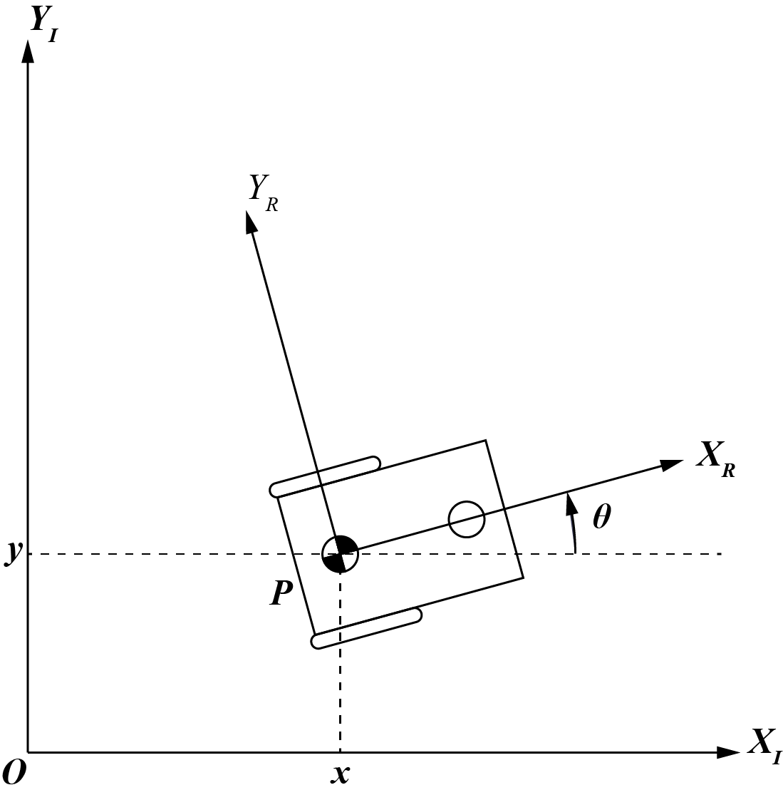
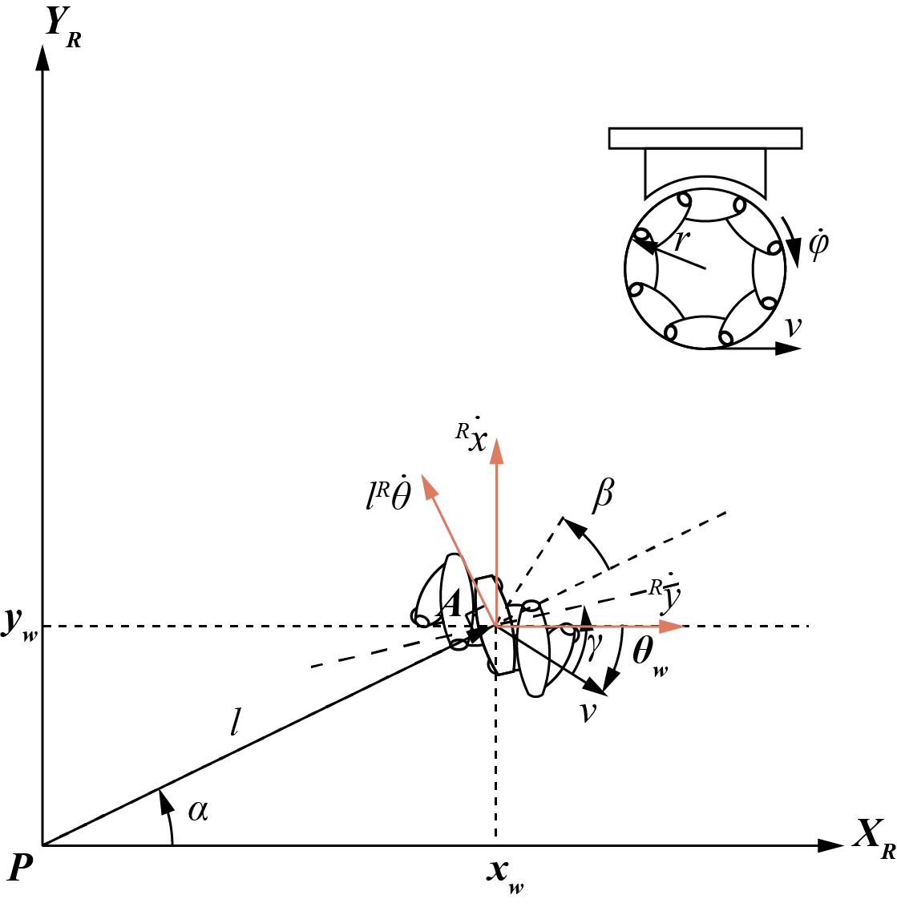

# 轮式机器人底盘约束求解

移动机器人的工作空间定义了移动机器人在其环境中可实现的所有可能姿态的范围。移动机器人的可控性定义了其在工作空间内可能的路径和轨迹。移动机器人也受到动力学的限制，例如，快速转弯时，较高的重心会带来翻车的风险，这限制了轮式移动机器人的实际转弯半径。理解机器人运动的过程首先是描述每个车轮对运动的贡献。每个轮子都在使整个机器人移动方面发挥作用。同样，每个轮子也对机器人的运动施加了限制，例如，拒绝横向滑行。

> 文章之后内容，若无特殊说明
>
> - *机器人* 指代 *轮式移动机器人*
> - 坐标系均为右手系
> - 当描述向量之间的角度时，向量出现的先后顺序表示前向量需要在两向量张成的平面上旋转该角度才能达到后向量

## 1. 机器人的建模

机器人的建模为一个在水平面上运行的带轮子的刚体，在平面上的总维度是三维，两维用于平面内的位置，另一维用于垂直于平面的轴线上的方向。当谈论机器人底盘时，仅指机器人的刚体部分，忽略了机器人内部及其轮子的关节和自由度 (由于轮轴、轮子转向关节和脚轮关节的存在，还有额外的自由度和灵活性)。

## 2 机器人的位姿描述以及速度映射

平面的全局坐标系和机器人的局部坐标系之间的关系如图所示。$\hat{X}_I$ 和 $\hat{Y}_I$ 定义了以平面上某点 $O$ 为坐标原点的全局坐标系 $\{ I \}$ 。为了指定机器人的位置，选择机器人底盘上的点 $P$ 作为其位置参考点 (通常为机器人底盘中心)。同样， $\hat{X}_R$ 和 $\hat{Y}_R$ 确定了以点 $P$ 为原点的机器人局部坐标系  $\{ R \}$ 。点 $P$ 在全局坐标系的位置表达为 $^IP_P={\begin{bmatrix} p_x & p_y &p_z\end{bmatrix}}^T$，姿态通过机器人局部坐标系在全局坐标系中的描述来表达，即
$$^I_RR=
\begin{bmatrix} {^I\hat{X}_R} & {^I\hat{Y}_R} & {^I\hat{Z}_R} \end{bmatrix}
=\begin{bmatrix}
  \hat{X}_{R}\cdot\hat{X}_{I} & \hat{Y}_{R}\cdot\hat{X}_{I} & \hat{Z}_{R}\cdot\hat{X}_{I}\\
  \hat{X}_{R}\cdot\hat{Y}_{I} & \hat{Y}_{R}\cdot\hat{Y}_{I} & \hat{Z}_{R}\cdot\hat{Y}_{I}\\
  \hat{X}_{R}\cdot\hat{Z}_{I} & \hat{Y}_{R}\cdot\hat{Z}_{I} & \hat{Z}_{R}\cdot\hat{Z}_{I}
\end{bmatrix}
=\begin{bmatrix} {^R\hat{X}_I}^T & {^R\hat{Y}_I}^T & {^R\hat{Z}_I}^T \end{bmatrix}$$

如此，可以得到 $\{ R \}$ 在 $\{ I \}$ 的描述 $\{ R \}=  \{ ^I_RR , ^IP_P \}$ 。

> 此处坐标系的描述采用机械臂中常用的符号描述，更多可以参考 ^[https://zhuanlan.zhihu.com/p/146835822]

按照机器人的建模， $Z_R \parallel Z_I$ ，点 $P$ 在全局坐标系的位置表达可以由点 $P$ 的位置 $x$ 和 $y$ 得到 $^IP_P={\begin{bmatrix} x & y & 0 \end{bmatrix}}^T$，姿态仅由 $X_I$ 和 $X_R$ 之间的角差 $\theta$ 给出
$$^I_RR=R_Z(\theta)= \begin{bmatrix}
  \cos{\theta} & -\sin{\theta} & 0\\
  \sin{\theta} & \cos{\theta} & 0\\
  0 & 0 & 1
\end{bmatrix}$$

机器人的位姿表达也可以简化为包含这三个元素的向量 $^I\xi ={\begin{bmatrix} x & y & \theta \end{bmatrix}}^T$。

为了将机器人在全局坐标系下的运动描述为在机器人局部坐标系下的运动，需要将沿着全局参考框架轴线的运动向量映射到沿着机器人局部参考框架轴线的运动分量。当然，这个映射是机器人当前姿态的函数，即 *正交旋转矩阵 $R_Z(\theta)$* 。给定全局参考框架中的某个速度向量 $^I\dot{\xi} ={\begin{bmatrix} \dot{x} & \dot{y} & \dot{\theta} \end{bmatrix}}^T$，可以得到其在机器人局部坐标系下的表达
$$^R\dot{\xi}=R_Z(\theta)^I\dot{\xi}=\begin{bmatrix}
  \cos{\theta} & -\sin{\theta} & 0\\
  \sin{\theta} & \cos{\theta} & 0\\
  0 & 0 & 1
\end{bmatrix}
\begin{bmatrix}
  \dot{x} \\ \dot{y} \\ \dot{\theta}
\end{bmatrix}
=\begin{bmatrix}
  ^R\dot{x} \\ ^R\dot{y} \\ ^R\dot{\theta}
\end{bmatrix}

$$

## 车轮的运动学约束

到目前为止，轮子已经成为移动机器人和一般车辆中最流行的运动机制：它可以提供非常高的效率，并且其机械实现相对简单。轮式机器人几乎总是设计为所有车轮时刻与地面接触。当使用超过三个车轮时，需要一个悬挂系统来确保机器人在遇到不平坦地形时所有轮子能保持接触地面。

目前，轮式移动机器人主要采用四种类型的轮子：标准轮 (standard wheel) 、脚轮 (caster wheel) 、 Swedish 轮 (Swedish wheel) 和球轮 (ball or spherical wheel) ，如下图所示。标准轮又根据是否控制转向分固定标准轮 (fixed standard wheel) 和转向标准轮 (steer standard wheel)。

在构建机器人的运动学模型的第一步是表达个别车轮运动的约束。这里有几个重要的假设：

1. 假定车轮的平面始终保持垂直，而且在所有情况下，车轮与地面平面之间只有一个接触点。
2. 假定在这个单一接触点没有任意方向的滑动。也就是说，车轮只在纯滚动条件下以及绕过接触点的垂直轴的旋转中发生运动。

在这些假设下，每种车轮都有两个约束：

1. 滚动约束：强制执行滚动接触的概念，即车轮在适当方向上发生运动时必须滚动，表达为 $v_{\parallel}=r\dot{\varphi}$，其中 $r$ 为车轮半径，$\dot{\varphi}$ 为车轮转速。
2. 无侧滑约束：强制执行没有横向滑移的概念，即车轮在垂直于车轮平面的方向上不得滑动，表达为 $v_{\perp}=0$。

在上述假设下，四种车轮都有一个垂直旋转轴和一个水平旋转轴。参数方面，车轮都有在机器人局部坐标系下的位姿描述 $^R\xi_w$、车轮半径 $r$ 、车轮转速 $\dot{\varphi}$ 和车轮速度向量 $v$。$^R\xi_w = {\begin{bmatrix} x_w & y_w & \theta_v \end{bmatrix}}^T$， $x_w$ 和 $y_w$ 为车轮垂直旋转轴在机器人局部坐标系下的位置，$\theta_v$ 为 $X_R$ 与车轮速度向量 $v$ 之间的夹角。车轮半径 $r$ 为水平转轴到地面接触点的距离。车轮转速 $\dot{\varphi}$ 具有正负号，根据实际情况确定。在车轮正向滚动时，车轮的地面接触点有一线速度向量，将其反向视为车轮速度向量 $v$ 且 $v=r\dot{\varPhi}$。

上述四种轮子与地面接触部分都可以视作一个标准轮，该标准轮总是存在上述滚动约束和无侧滑约束，但由于结构形态差异，整个轮子不一定存在滚动约束和无侧滑约束。

> 对于包括滑动接触在内的运动学的更全面处理，请参考^[Mason, M., Mechanics of Robotics Manipulation. Cambridge, MA, MIT Press,2001.]。

### 标准轮

假设在机器人局部坐标系下，标准轮在底盘上的安装如图所示。点 $A$ 为其与底盘连接的位置，也是其垂直旋转轴的投影位置以及地面接触点的位置。其位姿还可以用 ${\begin{bmatrix} \alpha & l & \beta \end{bmatrix}}^T$ 来描述。其中 $\alpha= \arctan(y_w,x_w)$，$l=\sqrt{x_w^2+y_w^2}$，$\beta=\theta_v+\pi/2-\alpha$。

给定底盘点 $P$ 在全局坐标系下的速度 $^I\dot{\xi}$，可以得到其在机器人局部坐标系下的描述 $^R\dot{\xi}$ 。
由于轮子和底盘刚性连接，因此点 $A$ 的速度包括 $\hat{X}_R$ 、 $\hat{Y}_R$ 方向上的速度 $^R\dot{x}$ 和 $\dot{y}_R$ 以及垂直于 $\overrightharpoon{PA}$ 的速度 $l\dot{\theta_R}$（由 $\dot{\theta_R}$ 根据右手法则确定方向）。

可以得到标准轮的滚动约束方程
$$\begin{bmatrix}
\sin{(\alpha+\beta)} & -\cos{(\alpha+\beta)} & -l\cos{\beta}
\end{bmatrix} ^R\dot{\xi} = r \dot{\varphi}
$$
以及无侧滑约束方程
$$\begin{bmatrix}
\cos{(\alpha+\beta)} & \sin{(\alpha+\beta)} & l\sin{\beta}
\end{bmatrix} ^R\dot{\xi} = 0
$$

固定标准轮一旦安装，其相对于底盘的位姿 $^R\xi_w$ 就确定了。当其作为主动驱动轮时，只有一个控制量 $\dot{\varphi}$，可以通过滚动约束方程求解以满足底盘运动速度的要求。当其作为被动轮时， $\dot{\varphi}$ 为自由量，滚动约束总能满足。但无论如何，固定标准轮总是存在无侧滑约束。

转向标准轮的运动学也为上述两个约束，但转向标准轮比固定标准轮要多一个自由度，即轮子可以绕着穿过轮子中心和地面接触点的垂直轴旋转。此时，$\beta$ 不再是一个固定值，而是一个时变函数 $\beta{(t)}$。从两个约束方程可以看出，$\dot{\beta}$ 对机器人当前的运动约束没有直接的影响。并且，与固定标准轮同样的，转动标准轮总是存在无侧滑约束。

### 脚轮

脚轮与转向标准轮基本相同，除了其垂直旋转轴并不通过其地面接触点。假设在机器人局部坐标系下，标准轮在底盘上的安装如图所示。点 $A$ 为其与底盘连接的位置，也是其垂直旋转轴的投影位置，点 $B$ 是其地面接触点的位置，记点 $B$ 与其垂直旋转轴的距离为 $d$。脚轮运动时，轮平面始终与 $\overrightharpoon{PA}$ 平行。与标准轮类似，可以得到脚轮的滚动约束
$$\begin{bmatrix}
\sin{(\alpha+\beta)} & -\cos{(\alpha+\beta)} & -l\cos{\beta}
\end{bmatrix} ^R\dot{\xi} = r \dot{\varphi}
$$
以及无侧滑约束方程
$$\begin{bmatrix}
\cos{(\alpha+\beta)} & \sin{(\alpha+\beta)} & l\sin{\beta}
\end{bmatrix} ^R\dot{\xi} + d\dot{\beta}= 0
$$

可以看到，垂直旋转轴的偏移对于平行于轮平面的运动没有作用，但是对无侧滑约束产生了重要影响。由于脚轮绕点 $A$ 旋转，其旋转速度为 $\dot{\beta}$ ，因此在与地面接触的标准轮的发现方向形成一个运动速度 $d\dot{\beta}$ ，其与 $^R\dot{\xi}$ 在与地面接触的标准轮法方向所形成的速度叠加值必须为 0 才能满足标准轮的无侧滑约束。

作为主动驱动轮时，根据上述约束方程可以找到合适的 $\dot{\varphi}$ 和 $\dot{\beta}$，使得满足底盘的速度需求，并使机器人的任意侧向运动变得可行。作为随动轮时，脚轮的 $\dot{\varphi}$ 和 $\dot{\beta}$ 都是自由量，上述方程都会被满足。

### Swedish 轮

Swedish 轮由主标准轮和附在主轮周围一圈的辊子组成。通常， Swedish 按照固定标准轮的方式进行安装，一旦安装，其在机器人局部坐标系的位姿将被 $^R\xi_w$ 确定。假设在机器人局部坐标系下，标准轮在底盘上的安装如图所示。点 $A$ 为其与底盘连接的位置，也是其垂直旋转轴的投影位置以及地面接触点的位置。与地面接触的棍子是标准轮。棍子的半径为 $r_{sw}$。转速为 $\dot{\varphi}_{sw}$，是一个自由量。主轮的轮速向量与棍子的水平转轴之间的夹角为 $\gamma$。通过棍子的无侧滑约束和滚动约束可以得到 Swedish 轮的滚动约束
$$\begin{bmatrix}
\sin{(\alpha+\beta+\gamma)} & -\cos{(\alpha+\beta+\gamma)} & -l\cos{(\beta+\gamma)}
\end{bmatrix} ^R\dot{\xi} = r \dot{\varphi}\cos{\gamma}
$$
以及无侧滑约束方程
$$\begin{bmatrix}
\cos{(\alpha+\beta+\gamma)} & \sin{(\alpha+\beta+\gamma)} & l\sin{(\beta+\gamma)}
\end{bmatrix} ^R\dot{\xi} =  r \dot{\varphi}\sin{\gamma} + r_{sw}\dot{\varphi}_{sw}
$$

由于 $\dot{\varphi}_{sw}$ 是一个自由量，Swedish 轮的无侧滑约束总能被满足。

#### 全向轮

全向轮 (omnidirectional wheel) 通常由一个大的中心轮和若干围绕中心轮边缘排列的棍子组成，这些棍子的轴线与大轮的轴线成90度角，即 90° Swedish 轮。这种设计允许轮子在中心轮的旋转方向上提供前进或后退的力，而棍子可以在垂直于中心轮旋转方向的任意角度上实现滑动。

#### 麦克纳姆轮

麦克纳姆轮的设计原理是在车轮的外环中安装了与轴心成45度角排列的辊子与地面接触，即 45° Swedish 轮，转动时摩擦力会产生与轮轴呈45度的反推力，这个斜向推力可以被分为纵向和横向两个向量的。整个车体由两对拥有辊子镜像排列的麦克纳姆轮所驱动，每个车轮各自会产生相应的向量的，这些向量的的合。终的活动状态。通过调节各个车轮独自的转向和转速，可以实现整个车体前行。等运动方式。

#### 全向轮和麦克纳姆轮的区别

在使用上，全向轮跟麦克纳姆轮是有一定差别的：

- 麦克纳姆轮通常情况下都是成对进行使用；而全向轮是可以独立使用的。
- 麦克纳姆轮通常连电机，作为驱动轮使用；而全向轮的话，即可以连接电机作为驱动轮使用，也可以作为随动轮使用，以替代万向轮，具有更好的方向与位置可控性。
- 麦克纳姆轮安装使用中，一般是平行共线成对安装。一组配对（2个）麦克纳姆轮的棍子方向是互相镜像对称的。两组麦克纳姆轮（4个）可以构建一个360度全向驱动的运动底盘，根据其与地面接触的棍子角度可以将安装方式分为 O 型和 X 型。
- 全向轮要构建360度全向轮驱动的运动底盘的话，需要借助轮子之间成角度的摆放，来形成向量合力。平行共线接电机的安装方式，无法为全向轮的棍子带来滚动动力。最少使用3个全向轮就可以构建一个360度全向驱动的运动底盘。其典型布置方式为三角形布置和十字形布置。

### 球轮

球轮的任意一个剖面都是一个标准轮，其运动学约束与标准轮完全相同，因此，可以得到球轮的滚动约束
$$\begin{bmatrix}
\sin{(\alpha+\beta)} & -\cos{(\alpha+\beta)} & -l\cos{\beta}
\end{bmatrix} ^R\dot{\xi} = r \dot{\varphi}
$$
以及无侧滑约束方程
$$\begin{bmatrix}
\cos{(\alpha+\beta)} & \sin{(\alpha+\beta)} & l\sin{\beta}
\end{bmatrix} ^R\dot{\xi} = 0
$$

如果对球轮进行驱动控制，则需要根据方向要求确定剖面，从而根据滚动约束方程计算 $\dot{\varphi}$。如果进行转向控制，则与转向标准轮基本一致。如果不进行转向控制，在剖面方向存在无侧滑约束，但在运动过程中，其方向容易受到扰动而变化，即 $\beta$ 是自由量，使得球轮本质上不存在无侧滑约束，是一个全方向系统。这一点在球轮作为被动轮时也适用。

### 轮的运动学约束和运动状态关系

|     轮     | 运动状态 | 滚动约束 | 无侧滑约束 |      控制要求      |
| :--------: | :------: | :------: | :--------: | :----------------: |
| 固定标准轮 |   驱动   |    有    |     有     |      转速控制      |
|            |   随动   |  总满足  |     有     |         无         |
| 转向标准轮 |   驱动   |    有    |     有     | 转速、转轴方向控制 |
|            |   随动   |  总满足  |     有     |         无         |
|    脚轮    |   驱动   |    有    |   总满足   | 转速、转轴方向控制 |
|            |   随动   |  总满足  |   总满足   |         无         |
|   瑞典轮   |   驱动   |    有    |   总满足   |      转速控制      |
|            |   随动   |  总满足  |   总满足   |         无         |
|    球轮    |   驱动   |    有    |     有     | 转速、转轴方向控制 |
|            |   随动   |  总满足  |   总满足   |         无         |

- 驱动状态下
通过轮的全部参数来生成 $^R\dot{\xi}$
- 随动状态下
通过 $^R\dot{\xi}$ 来生成轮的部分参数，如转速和转轴方向

但无论在哪个运动状态，都是通过轮的运动约束来生成。

## 机器人的运动学约束

### 基于标准轮

假设机器人共有N个标准轮，其参数如下
$N_f$ 个固定标准轮，轮子 $N_f\times 1$ 的角度向量 $\beta_f$ ，$N_f\times 1$ 的旋转速度向量 $\dot{\varphi}_f$
$N_s$ 个固定标准轮，轮子 $N_s\times 1$ 角度的向量 $\beta_s$， $N_s\times 1$ 旋转速度的向量 $\dot{\varphi}_s$
则机器人约束可以表示为
$$\begin{pmatrix}
  \mathbf{J_{1}(\beta_s)}\\
  \mathbf{C_{1}(\beta_s)}  
\end{pmatrix} \mathbf{^R\dot{\xi}}=
\begin{pmatrix}
  \mathbf{J_{2}\dot{\varphi }} \\
  0
\end{pmatrix}$$
其中
$$\begin{align*}
  \mathbf{J_{1}} &= \begin{pmatrix} \mathbf{J_{1f}} \\\mathbf{J_{1s}(\beta_s)} \end{pmatrix}, \\
  \mathbf{C_{1}(\beta)} &= \begin{pmatrix} \mathbf{C_{1f}}\\\mathbf{C_{1s}(\beta_s)}  \end{pmatrix}, \\
  \mathbf{\dot{\varphi }} &= \begin{pmatrix} \mathbf{\dot{\varphi }_f(t)}\\\mathbf{\dot{\varphi }_s(t)} \end{pmatrix}
\end{align*}
$$

其中
$\mathbf{J_{1f}}$ ， $\mathbf{J_{1s}(\beta_s)}$ 分别为 $N_f\times 3$ 和 $N_s\times 3$ 的矩阵 $\mathbf{C_{1f}}$ ，$\mathbf{C_{1s}(\beta_s)}$ 分别为 $N_f\times 3$ 和 $N_s\times 3$ 的矩阵:

$$
\begin{align*}
  \mathbf{J_{1f}} &= \begin{bmatrix}\sin(\mathbf{\alpha_{f}}+\mathbf{\beta_{f}})&-\cos(\mathbf{\alpha_{f}}+\mathbf{\beta_{f}})&(-l)\cos\mathbf{\beta_{f}}\end{bmatrix}\\
  \mathbf{J_{1s}(\beta_s)} &= \begin{bmatrix}\sin(\mathbf{\alpha_{s}}+\mathbf{\beta_{s}})&-\cos(\mathbf{\alpha_{s}}+\mathbf{\beta_{s}})&(-l)\cos\mathbf{\beta_{s}}\end{bmatrix} \\
  \mathbf{C_{1f}} &= \begin{bmatrix}\cos(\mathbf{\alpha_{f}}+\mathbf{\beta_{f}})&\sin(\mathbf{\alpha_{f}}+\mathbf{\beta_{f}})&l\sin\mathbf{\beta_{f}}\end{bmatrix}\\
  \mathbf{C_{1s}(\beta_s)} &= \begin{bmatrix}\cos(\mathbf{\alpha_{s}}+\mathbf{\beta_{s}})&\sin(\mathbf{\alpha_{s}}+\mathbf{\beta_{s}})&l\sin\mathbf{\beta_{s}}\end{bmatrix}
\end{align*}
$$
此处假定所有轮子的 $l$ 都是一致的常数，
其展开为
$\mathbf{J_{1f}}=\begin{bmatrix}\sin(\mathbf{\alpha_{f}}+\mathbf{\beta_{f}})&-\cos(\mathbf{\alpha_{f}}+\mathbf{\beta_{f}})&(-l)\cos\mathbf{\beta_{f}}\end{bmatrix}$
$\mathbf{J_2}$为 $N\times N$ 的对角矩阵，对角元素为各轮的半径。

### 更一般的约束公式

假设机器人共有 $N$ 个轮子。

通过对四种车轮滚动约束和无侧滑约束的叠加，有
$$\begin{bmatrix}
  \sin \left ( \alpha_1 +\beta_1 +\gamma_1  \right ) & -\cos \left ( \alpha_1 +\beta_1 +\gamma_1  \right ) & -l_1\cos \left ( \beta_1 +\gamma_1  \right ) \\
  &  \dots & \\
  \sin \left ( \alpha_N +\beta_N +\gamma_N  \right )& -  \cos \left ( \alpha_N +\beta_N +\gamma_N  \right ) & -l_N\cos \left ( \beta_N +\gamma_N  \right ) \\
 \cos \left ( \alpha_1 +\beta_1 +\gamma_1  \right )&\sin \left ( \alpha_1 +\beta_1 +\gamma_1  \right )&l_1\sin \left ( \beta_1 +\gamma_1  \right )+d_1\dot{\beta} \\
&\dots&\\
\cos \left ( \alpha_N +\beta_N +\gamma_N  \right )&\sin \left ( \alpha_N +\beta_N +\gamma_N  \right )&l_N\sin \left ( \beta_N +\gamma_N  \right )+d_N\dot{\beta}
\end{bmatrix}\mathbf{^R\dot{\xi}}=\begin{bmatrix}
 r_1\dot{\varphi }_1 \cos \gamma _1\\
 \dots \\
  r_N\dot{\varphi }_N \cos {\gamma _N}\\
 r_1\dot{\varphi }_1\sin \gamma _1+r_{sw1}\dot{\varphi} _{sw1} \\
 \dots\\
 r_N\dot{\varphi }_N\sin \gamma _N+r_{swN}\dot{\varphi} _{swN}
\end{bmatrix}$$

其中，$\overrightharpoon{l}_i$ 为机器人局部坐标系原点指向车轮垂直旋转轴的向量。
$l_i=||\overrightharpoon{l}_i||$。
$\alpha_i$ 为 $\hat{X}_R$ 与 $\overrightharpoon{l}_i$ 之间的夹角。
$\beta_i$ 为 $\overrightharpoon{l}_i$ 与车轮法向量之间的夹角，法向量的方向由车轮正向旋转时通过右手法则确定。
$d_i$ 与地面接触接触点与控制车轮转向的垂直旋转轴的距离，一般对非脚轮而言，此值为 0 。
$\gamma_i$ 为棍子的水平转轴和车轮速度向量 $v_i$ 之间的夹角，$r_{swi}$ ，$\dot{\varphi} _{swi}$ 分别为与地面接的的棍子的半径和转速，对于没有棍子的车轮，该值为 0 。

该式适合于快速搭建矩阵进行矩阵运算。

## 运动学约束求解
当作为驱动轮时，需要通过约束方程生成相应的速度和角度控制来达到需要的速度和转速要求
当作为随动轮时，会通过约束方程按照已有的速度和转速情况生成相应的速度和角度结果

### 矩阵方法
使用支持矩阵和常微分(或进行数值近似)的编程语言可以快速求解

### 单独求解

假设机器人共有 $N$ 个轮子。对于第 $i$ 个轮子，有
$$\begin{bmatrix}
  \sin \left ( \alpha_i +\beta_i +\gamma_i  \right ) & -\cos \left ( \alpha_i +\beta_i +\gamma_i  \right ) & -l_i\cos \left ( \beta_i +\gamma_i  \right ) \\
 \cos \left ( \alpha_i +\beta_i +\gamma_i  \right )&\sin \left ( \alpha_i +\beta_i +\gamma_i  \right )&l_i\sin \left ( \beta_i +\gamma_i  \right )+d_i \dot{\beta} \\
\end{bmatrix}\mathbf{^R\dot{\xi}}=\begin{bmatrix}
 r_i\dot{\varphi }_i \cos \gamma_i\\
 r_i\dot{\varphi }_i\sin \gamma_i+r_{swi}\dot{\varphi}_{swi}
\end{bmatrix}$$

将矩阵展开，则有
$$\begin{cases}
 \sin \left ( \alpha_i +\beta_i +\gamma_i  \right ) ^R\dot{x}
 -\cos \left ( \alpha_i +\beta_i +\gamma_i  \right )\dot{y}_R
 -l_i\cos \left ( \beta_i +\gamma_i  \right )\dot{\theta}_R & = r_i\dot{\varphi }_i\cos {\gamma _i} \\
\cos \left ( \alpha_i +\beta_i +\gamma_i  \right )^R\dot{x}
+\sin \left ( \alpha_i +\beta_i +\gamma_i  \right )\dot{y}_R
+\left (l_i\sin \left ( \beta_i +\gamma_i  \right )+d_i\dot{\beta}  \right ) \dot{\theta}_R & = r_i\dot{\varphi }_i\sin \gamma _i+r_{swi}\dot{\varphi} _{swi}
\end{cases}$$

对于主动驱动轮，都可以通过滚动约束来计算满足底盘运动速度的车轮转速。对于可以控制转向的车轮，可以通过无侧滑约束来计算合适的转向角来满足底盘在任意侧向的运动。

#### 固定标准轮和 Swedish 轮的解算

固定标准轮和 Swedish 轮通常一旦安装，其在机器人局部坐标系的位姿就固定，它们只有一个控制量，即车轮转速 $\dot{\varphi}$ ，。给定 $^R\dot{\xi}=\begin{bmatrix} ^R\dot{x} & ^R\dot{y} & ^R\dot{\theta} \end{bmatrix}$，根据滚动约束 $\sin \left ( \alpha_i +\beta_i +\gamma_i  \right ) ^R\dot{x} -\cos \left ( \alpha_i +\beta_i +\gamma_i  \right )\dot{y}_R -l_i\cos \left ( \beta_i +\gamma_i  \right )\dot{\theta}_R = r_i\dot{\varphi }_i\cos {\gamma _i}$ ，可以得到
$$\dot{\varphi }_i=\frac{
\sin \left ( \alpha_i +\beta_i +\gamma_i  \right ) ^R\dot{x}
 -\cos \left ( \alpha_i +\beta_i +\gamma_i  \right )\dot{y}_R
 -l_i\cos \left ( \beta_i +\gamma_i  \right )\dot{\theta}_R}
{r_i\cos\gamma_i}$$
##### 转向标准轮和球轮的解算
若将球轮的水平转轴视作标准轮的法线，则球轮可以视作一个转向标准轮。
对于转向标准轮，变量只有 $\dot{\varphi}_i$ 和 $\beta_i$ ，约束方程组可以简化为

$$\begin{cases}
 \left (^R\dot{x} \cos \alpha_i + \dot{y}_R\sin \alpha_i \right )\sin \beta _{i} - \left ( ^R\dot{x} \sin \alpha_i- \dot{y }_R\cos \alpha_i-l \dot{\theta }_R \right )\cos\beta _{i}
=r_i\dot{\varphi}_i\\
 \left (^R\dot{x} \cos \alpha_i + \dot{y}_R\sin \alpha_i \right )\cos \beta _{i}  - \left ( ^R\dot{x} \sin \alpha_i- \dot{y }_R\cos \alpha_i-l \dot{\theta }_R \right )\sin\beta _{i}
=0
\end{cases}$$

设 $var_1 = ^R\dot{x} \cos \alpha_i + \dot{y}_R\sin \alpha_i$ , $var_2 = ^R\dot{x} \sin \alpha_i- \dot{y }_R\cos \alpha_i-l \dot{\theta }_R$，分别通过其无侧滑约束和滚动约束，可以得到

$$\begin{align*}
  \beta_{ref_{i}} &=
    \begin{cases}
      Atan2(var_1,var_2) & if \left \| ^R\dot{\xi}  \right \|\neq 0\\
      0 & if \left \| ^R\dot{\xi}  \right \|= 0
    \end{cases}\\
  \dot{\varphi}_i &= \frac{ var_1 \sin \beta _{i} - var_2 \cos\beta _{i} }{r_i}
\end{align*}$$

除此之外，转向标准轮为了达到更好的控制效果，需要更多的优化选项，这将在之后进行讨论。

#### 脚轮的解算

对于脚轮，变量只有 $\dot{\varphi}_i$ 和 $\beta_i$ ，约束方程组可以简化为
$$\begin{cases}
 \left (^R\dot{x} \cos \alpha_i + \dot{y}_R\sin \alpha_i \right )\sin \beta _{i} - \left ( ^R\dot{x} \sin \alpha_i- \dot{y }_R\cos \alpha_i-l \dot{\theta }_R \right )\cos\beta _{i}
=r_i\dot{\varphi}_i
\\
 \left (^R\dot{x} \cos \alpha_i + \dot{y}_R\sin \alpha_i \right )\cos \beta _{i} - \left ( ^R\dot{x} \sin \alpha_i- \dot{y }_R\cos \alpha_i-l \dot{\theta }_R \right )\sin\beta _{i} +d_i\dot{\beta}_i
=0
\end{cases}$$
简化其无侧滑约束为
$$a_i\cos\beta_i+b_i\sin\beta_i+d_i\dot\beta_i=0$$
其中， $a_i$ 、 $b_i$ 、 $d_i$ 为常数，且$a_i=^R\dot{x} \cos \alpha_i + \dot{y}_R\sin \alpha_i$，$b_i=- \left ( ^R\dot{x} \sin \alpha_i- \dot{y }_R\cos \alpha_i-l \dot{\theta }_R \right )$
则有，
$$\dot{\beta }_i= \frac{\mathrm{d}\beta _i }{\mathrm{d}t } =-\frac{a_i\cos\beta_i+b_i\sin\beta_i}{d_i} $$
即
$$-\frac{\mathrm{d}\beta_i }{a_i\cos\beta_i+b_i\sin\beta_i} =\frac{\mathrm{d}t }{d_i} $$
分别对左右两边积分
 $$\int -\frac{\mathrm{d}\beta_i }{a_i\cos\beta_i+b_i\sin\beta_i} =\int \frac{\mathrm{d}t }{d_i} =\frac{\bigtriangleup  t}{d_i} $$
因为
$$\cos \beta _i = \frac{1-\tan ^{2} \frac{\beta _i}{2} }{1+\tan ^{2 } \frac{\beta _i}{2}} ,\space
\sin \beta _i = \frac{\tan \frac{\beta_i }{2} }{1+\tan ^{2} \frac{\beta _i}{2}} $$
则令 $\tan \frac{\beta _i }{2}=t_i$ ， $\mathrm{d}\beta _i=2\cdot \frac{1}{1+t_i^{2} } \mathrm{d}t_i$，
则
$$\begin{align*}
\int -\frac{\mathrm{d}\beta_i }{a_i\cos\beta_i+b_i\sin\beta_i} &=\int {\frac{2\mathrm{d}t_{i} }{a_it_i^2-2b_it_i-a_i} }\\
&=\int {\frac{2\mathrm{d}t _i}{\frac{a_i^2+b_i^2}{a_i}\left
[ \frac{a_i^2}{a_i^2+b_i^2} \left ( t_i-\frac{b_i}{a_i}  \right ) ^2 -1\right ]  } }\\
&=\frac{2a_i}{a_i^2+b_i^2} \int {\frac{\mathrm{d}t _i}{\left [
\frac{a_i}{\sqrt{a_i^2+b_i^2} }\left ( t_i-\frac{b_i}{a_i}  \right )
 \right ] ^2-1} }
\end{align*}$$
令 $m_i=\frac{a_i}{\sqrt{a_i^2+b_i^2} }\left ( t_i-\frac{b_i}{a_i}  \right )$ ， $\mathrm{d}t _i=\frac{\sqrt{a_i^2+b_i^2} }{a_i}\mathrm{d}m_i$，
则
$$\begin{align*}
\int -\frac{\mathrm{d}\beta_i }{a_i\cos\beta_i+b_i\sin\beta_i} &=\frac{2}{\sqrt{a_i^2+b_i^2}} \int \frac{\mathrm{d}m_i }{m_i^2-1} \\
&=\frac{1}{\sqrt{a_i^2+b_i^2}} \int \left (  
\frac{1}{m_i-1}- \frac{1}{m_i+1}
\right ) \mathrm{d}m_i \\
&=\frac{1}{\sqrt{a_i^2+b_i^2}}\ln_{}{\frac{m_i-1}{m_i+1} } +C
\end{align*}$$
即
$$\frac{1}{\sqrt{a_i^2+b_i^2}}\ln_{}{\frac{m_i-1}{m_i+1} } +C=\frac{\bigtriangleup  t}{d_i}$$
即
$$m_i=\frac{1+\exp c_i}{1-\exp c_i},c_i=\sqrt{a_i^2+b_i^2} \left ( \frac{\bigtriangleup  t}{d_i} -C \right )$$
又因为 $m_i= \frac{a_i}{\sqrt{a_i^2+b_i^2} }\left ( t_i-\frac{b_i}{a_i}  \right )$ ， $\tan \frac{\beta _i }{2}$，
所以
$$\beta_i=2\arctan {\frac{\sqrt{a_i^2+b_i^2}m_i+b_i }{a_i} }$$

**如何消去常数项 $C$**

现假设采样时间间隔为 $\bigtriangleup  t$，已知当前的初始值 $\beta_{i0}$，则
$$C=-\frac{1}{\sqrt{a_i^2+b_i^2}}\ln_{}{\frac{m_i-1}{m_i+1} } =-\frac{1}{\sqrt{a_i^2+b_i^2}}\ln_{}{\frac{m_{i0}-1}{m_{i0}+1} }$$
将 $\beta_{i0}$ 代入 $m_{i0}= \frac{a_i}{\sqrt{a_i^2+b_i^2} }\left ( \tan \frac{\beta _{i0} }{2}-\frac{b_i}{a_i}  \right )$，即可求得常数 $C$。

再根据其滚动约束，可以得到
$$\dot{\varphi}_i =\frac{\left (^R\dot{x} \cos \alpha_i + \dot{y}_R\sin \alpha_i \right )\sin \beta _{i} - \left ( ^R\dot{x} \sin \alpha_i- \dot{y }_R\cos \alpha_i-l \dot{\theta }_R \right )\cos\beta _{i} }{r_i} $$

因为其控制较复杂，一般脚轮是作随动轮。此外，脚轮 $\beta$ 角变化还会给机器人本身带来一定的转矩影响。

## 参考链接
[right hand rule](https://wuli.wiki//online/RHRul.html)
[introduction to autonomous mobile robots](https://vdoc.pub/download/introduction-to-autonomous-mobile-robots-42fhm17lqoc0)
本文主要通过翻译、整理以及文章作者经验完成
