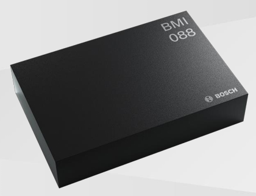
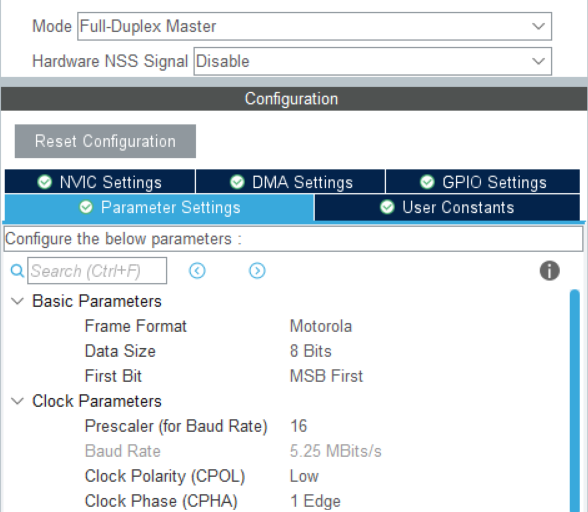

# IMU（Inertial Measurement Unit）设备组件

<sp> 

## 理论

惯性测量单元(Inertial measurement unit，简称 IMU)，是测量物体三轴姿态角及加速度的装置。一般IMU包括三轴陀螺仪及三轴加速度计，部分IMU还包括三轴磁力计。

### BMI088



BMI088 是一款能检测运动与旋转共 6 个自由度的 IMU。其将两个惯性传感器的功能包括在了一个设备之中：一个先进的三轴 16-bit 陀螺仪和一个多功能、先进的三轴 16-bit 加速度计。

BMI088 为满足在剧烈震动环境下高性能消费类设备的所有需求，如比那些安装在无人机和机器人上的设备。该 IMU 是为有效抑制高于几百赫兹的震动而设计的，而这些震动往往因 PCB 或系统结构的谐振而产生。

该 IMU 能够提供三轴的加速度与三轴的角速度，同时还能提供温度测量的功能。可以通过 SPI 或 I2C 的协议与该 IMU 进行通信。

- 组件中仅使用 SPI 协议进行通信

> 以 RoboMaster 开发板 C 型为例，板上已集成一个 BMI088，使用 `SPI1` 进行通信需要的硬件配置方式如下图所示：
> 
> 需要配置其中的 CS_Accel、CS1_Gyro、SPI1_CLK、SPI1_MOSI 与 SPI1_MISO 引脚

## 快速开始

组件源码仓库地址：<https://github.com/ZJU-HelloWorld/HW-Components>

### 外设驱动配置

在使用 SPI 与 BMI088 通信时，使用 CubeMX 配置时将对应 SPI 的波特率调整至合理值（10Mbits/s 以下）。例如对于 RoboMaster 开发板 C 型板载的红点激光器，驱动流程如下：

* 对于 SPI1，调整器分频值（Prescaler），使其波特率在 10Mbits/s 以下。
* 需改 SPI1 时钟极性（CPOL）与时钟相位（CPHA）至要求值（CPOL=Low，CPHA=1 Edge或CPOL=High，CPHA=2 Edge）



* 配置片选信号线的 GPIO


### 使用前准备

本组件依赖 CMSIS-DSP 运算加速。

使用前需要做以下准备：

* 在 `config.cmake` 文件中设置 `use_hwcomponents_devices_imu` 选项为 `ON`，开启该设备文件的编译，若为 `OFF` 则根驱动配置需求在 `CMakeLists.txt` 文件中重配置为 `ON`。

### 示例

在项目中引用头文件：

```cpp
#include "imu.hpp"

namespace hw_imu = hello_world::imu;
```

实例化一个 BMI088 硬件配置结构体并进行相关配置，同时根据安装方式设定旋转矩阵，如：

```cpp
hw_imu::BMI088HWConfig hw_config = {
  .hspi = &hspi1,
  .acc_cs_port = GPIOA,
  .acc_cs_pin = GPIO_PIN_4,
  .gyro_cs_port = GPIOB,
  .gyro_cs_pin = GPIO_PIN_0,
};

float rot_mat_flatten[9] = {
    1, 0, 0,
    0, 1, 0,
    0, 0, 1};
```

实例化一个 BMI088 组件并放入对应硬件配置进行初始化，如：

```cpp
hw_imu::BMI088* imu_ptr = nullptr;

imu_ptr = new hw_imu::BMI088(hw_config, rot_mat_flatten);
```

当有特殊需求时，还可以调整 BMI088 的配置，如：

```cpp
hw_imu::BMI088Config config = {
    .acc_range = hw_imu::kBMI088AccRange3G,
    .acc_odr = hw_imu::kBMI088AccOdr1600,
    .acc_osr = hw_imu::kBMI088AccOsr4,
    .gyro_range = hw_imu::kBMI088GyroRange1000Dps,
    .gyro_odr_fbw = hw_imu::BMI088GyroOdrFbw1000_116,
};

imu_ptr = new hw_imu::BMI088(hw_config, rot_mat_flatten, config);
```

- `BMI088Config` 具有默认参数，因此可以在需要对某些默认参数进行修改时进行个别修改，但是需要保证前后结构体成员前后的复制顺序需要与结构体中的声明顺序相同

然后调用方法 `imuInit` 对 BMI088 的进行配置, 如：

```cpp
while (imu_ptr->imuInit() != hw_imu::kBMI088ErrStateNoErr) {
}
```

在配置成功后，可调用方法 `getData` 获取传感器数据，如：

```cpp
float gyro_data[3], acc_data[3], temp;
imu_ptr->getData(acc_data, gyro_data, &temp);
```

- 可以传入空指针 `nullptr` 作为参数，此时不会读取对应的数据

> **注意：由于内部使用了硬件句柄，因此如果计划将实例作为全局变量时（全局变量初始化时对应的硬件句柄可能会还未初始化完毕），建议采取一下方法：**
>
> 1. 声明指针，后续通过 **`new`** 的方式进行初始化。
> 2. 声明指针，后续通过返回函数（CreateXXXIns）中的静态变量（因为该变量只有在**第一次调用**该函数时才会运行初始化程序）进行初始化。
> 3. 使用无参构造函数，后续调用 **`init`** 方法进行初始化。
> 4. 使用无参构造函数，后续使用**拷贝赋值函数**或是**移动赋值函数**进行初始化。

## 附录

### BMI088 手册

[BMI088 数据手册](IMU设备组件.assets/Bosch-BMI088.pdf)

### 版本说明

| 版本号                                                       | 发布日期   | 说明               | 贡献者 |
| ------------------------------------------------------------ | ---------- | ------------------ | ------ |
|  | 2023.12.12 | IMU 组件（Cpp） | 蔡坤镇 |
|  | 2023.12.13 | 添加旋转配置 | 蔡坤镇 |