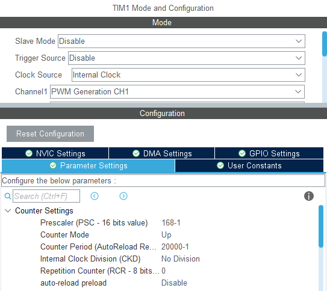

# 舵机（Servo）设备组件

  <sp> 

## 理论

舵机是机器人中的常见执行部件，适用于简单的动作控制，通常使用特定频率的 PWM 进行驱动。实车上舵机可应用于控制弹仓盖开合等场景。

通常使用三根线一组来驱动舵机，按照颜色分别对应： `黑色 / 棕色 - GND`，`红色 - VCC`，`黄色 / 白色 - PWM 信号`。使用舵机时，将与其连接的杜邦线接入对应的 PWM 接口。下图为市面上常见的舵机：


舵机使用的 PWM 信号一般频率为 50Hz，高电平时间为 0.5ms - 2.5ms。不同占空比的 PWM 信号线性对应舵机转动的目标角度，以 180 度舵机为例，对应角度图如下图所示：


> 以 RoboMaster 开发板 C 型为例，板上有 7 个 PWM 接口，原理图和实物图如下图所示：
>
> 
>
> 从右至左对应 `TIM1 CHANNEL 1-4, TIM8 CHANNEL 1-3`

## 快速开始

组件源码仓库地址：<https://github.com/ZJU-HelloWorld/HW-Components>

### 外设驱动配置

在使用 PWM 波控制舵机时，需要注意查阅舵机参数，并在使用 CubeMX 配置时将对应定时器预分频至 1MHz，以方便控制。例如对一个工作频率 50Hz - 300Hz 的舵机，工作脉宽 500us - 2500us，工作角度 0-180°，连接至 RoboMaster 开发板 C 型 `TIM1 CH1`，驱动流程如下：

* 对于 TIM1，查看数据手册可知其挂载在 APB2 总线上，时钟频率 168MHz，为达到 1MHz 需要 168 分频 ，因此将预分频值（Prescaler）设置为 167；
* 工作频率定为 50Hz，对应周期为 20ms (20000us)，因此重载值（Counter Period）设置为 19999。此“工作频率”选项仍可在组件初始化时指定更改，CubeMX 配置可随意；
* 设置初始高电平时间即脉宽（Pulse），一般最小为 0.5ms，即 500us，占空比 2.5%，对应了最小角度 0°；最大为 2.5ms，即 2500us，占空比 12.5%，对应了最大角度 180°. 此“初始角度”选项可在组件初始化时更改，“角度”选项可在组件运行时更改，CubeMX 配置可随意。



### 使用前准备

使用前需要做以下准备：

* 在 `config.cmake` 文件中设置 `use_hwcomponents_devices_servo` 选项为 `ON`，开启该设备文件的编译，若为 `OFF` 则根驱动配置需求在 `CMakeLists.txt` 文件中重配置为 `ON`。

### 示例

在项目中引用头文件：

```cpp
#include "servo.hpp"
```

实例化一个舵机设备指针：

```cpp
namespace hw_servo = hello_world::servo;
hw_servo::Servo *servo_ptr = nullptr;
```

创建参数结构体数组，初始化舵机设备，默认使能，如：

```cpp
// servo::ServoInfo servo_info = {
//     .operating_freq = 50.0f,
//     .min_pulse_duration = 500,
//     .max_pulse_duration = 2500,
//     .angle_range = 180.0f,
// };
// servo_ptr = new servo::Servo(&htim1, TIM_CHANNEL_1, servo_info, 0);
servo_ptr = new hw_servo::Servo(&htim1, TIM_CHANNEL_1,
                              hw_servo::ServoInfo{
                                  .operating_freq = 50.0f,
                                  .min_pulse_duration = 500,
                                  .max_pulse_duration = 2500,
                                  .angle_range = 180.0f,
                              },
                              0);
```

设定舵机角度：

```cpp
float target_angle = 10.0f;
servo_ptr->setAngle(target_angle);
```

> **注意：由于内部使用了硬件句柄，因此如果计划将实例作为全局变量时（全局变量初始化时对应的硬件句柄可能会还未初始化完毕），建议采取一下方法：**
> 1. 声明指针，后续通过 **`new`** 的方式进行初始化。
> 2. 声明指针，后续通过返回函数（CreateXXXIns）中的静态变量（因为该变量只有在**第一次调用**该函数时才会运行初始化程序）进行初始化。
> 3. 使用无参构造函数，后续调用 **`init`** 方法进行初始化。
> 4. 使用无参构造函数，后续使用**拷贝赋值函数**或是**移动赋值函数**进行初始化。

## 附录

### 版本说明

| 版本号                                                       | 发布日期   | 说明         | 贡献者 |
| ------------------------------------------------------------ | ---------- | ------------ | ------ |
|  | 2022.12.07 | 发布舵机组件 | 薛东来 |
|  | 2022.12.10 | 发布舵机组件（Cpp） | 蔡坤镇 |

### 参考资料

[1] RoboMaster 开发板 C 型嵌入式软件教程文档. [Github 仓库](https://github.com/RoboMaster/Development-Board-C-Examples)
