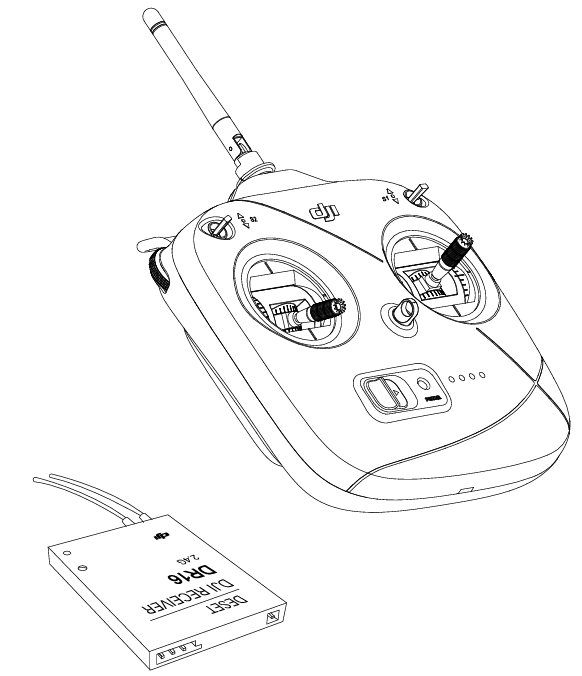
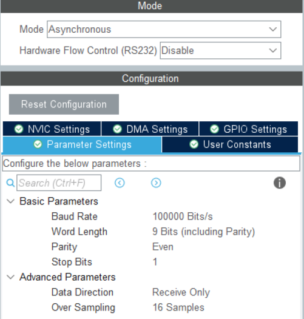

# 遥控器（Remote Control）设备组件

<sp> 

## 适用遥控器

当前组件适用的遥控器有：DT7 遥控器，天地飞 ET08A 遥控器，同时也有适配 SBus 协议的基类。

## 理论

DT7 遥控器是一款工作于 2.4 GHz 频段的无线电通信设备，该遥控器仅能与 DR16 接收机配合使用。如下图所示：



使用时，将 DR16 的接口接到 Dbus 接口，以实现对遥控器指令的读取。

> 以 RoboMaster 开发板 C 型为例，板上已集成一个 Dbus 接口，如下图所示：
>
> 
>
> 对应的接收引脚为 `PC11`，信号由 `UART3` 接收。

**同时，由于 Dbus 电平以及通信协议与市面上遥控器常见通信协议 SBus 通用，因此该配置方法也适用。**

## 快速开始

组件源码仓库地址：<https://github.com/ZJU-HelloWorld/HW-Components>

### 外设驱动配置

在使用 Dbus 接收遥控器指令时，使用 CubeMX 配置时将对应串口波特率调整至 100k，偶校验。例如对于 RoboMaster 开发板 C 型板载的 Dbus，驱动流程如下：

* 对于 USART3，将波特率配置为 100000Bit/s，字长 9Bits (including Parity)，校验位偶校验（Even），数据方向为只接收（Receive Only）。



DMA 配置详见[通用通信驱动](https://zju-helloworld.github.io/Wiki/组件说明/嵌入式系统支持/板级支持包/通用通信驱动/) 中 UART 部分的 DMA 配置。

### 使用前准备

使用前需要做以下准备：

* 在 `config.cmake` 文件中设置 `use_hwcomponents_devices_remote_control` 选项为 `ON`，开启该设备文件的编译，若为 `OFF` 则根驱动配置需求在 `CMakeLists.txt` 文件中重配置为 `ON`。

### 示例

在项目中引用头文件：

```cpp
#include "DT7.hpp"
#include "uart_rx_mgr.hpp"

namespace hw_comm = hello_world::comm;
namespace hw_rc = hello_world::remote_control;
```

实例化一个遥控器设备并将其加入串口接收管理器中，如：

```cpp


hw_rc::DT7* rc_ptr;
hw_comm::UartRxMgr* rc_rx_mgr_ptr = nullptr;

void RcInit(void)
{
  /* 事先完成管理器的初始化 */
  rc_rx_mgr_ptr = new hw_comm::UartRxMgr(
      &huart3, hw_comm::UartRxMgr::EofType::kIdle,
      hw_rc::DT7::kRcRxDataLen + 1, hw_rc::DT7::kRcRxDataLen);

  rc_ptr = new hw_rc::DT7();
  rc_rx_mgr_ptr->addReceiver(rc_ptr);


  /* 事后调用接收管理器的开启接收 */
}
```

接收管理器的其他配置按要求进行，详见 [通用通信驱动](https://zju-helloworld.github.io/Wiki/组件说明/嵌入式系统支持/板级支持包/通用通信驱动/) 中 UART 部分的使用方法。

在遥控器使用中，遥控器的接收端常常与看门狗刷新绑定，当关闭遥控器后，看门狗刷新也随之关闭，进而测量运行程序被杀死。因此可采用如下方法将看门狗刷新函数注册如遥控器内种，当接收到遥控器数据时会调用刷新函数：

```cpp
/* 看门狗刷新函数（封装） */
static void RefreshIwdg(void)
{
  HAL_IWDG_Refresh(&hiwdg1);
}

void RcInit(void)
{
  /* 事先完成管理器的初始化 */

  rc_ptr = new hw_rc::DT7();
  /* 注册更新回调函数，用于在接收到遥控器信号时刷新看门狗 */
  rc_ptr->registerUpdateCallback(RefreshIwdg);


  /* 事后调用接收管理器的开启接收 */
}
```

然后可通过对应的类方法获取遥控器指令：

```cpp
if (rc_ptr->rc_l_switch() == hw_rc::SwitchState::kUp) {
  // ...
}
```

同时由于遥控器接收频率往往低于控制频率，因此可通过 `isUpdate` 接口判断当前数据是否是新收到的数据。

```cpp
/* 当遥控器更新时处理数据 */
if (rc_ptr->isUpdate()) {
  rc_ptr->clearUpdateFlag();
  ...
}
```

## 调试技巧

1. 遥控器实例中具有解码成功次数 `decode_success_cnt_` 和解码失败次数 `decode_fail_cnt_` 数据成员，当二者之和随时间增长变大时说明成功收到了遥控器的数据。

## 附录

### 版本说明

| 版本号                                                       | 发布日期   | 说明               | 贡献者 |
| ------------------------------------------------------------ | ---------- | ------------------ | ------ |
|  | 2023.12.12 | 发布遥控器组件（Cpp） | 蔡坤镇 |