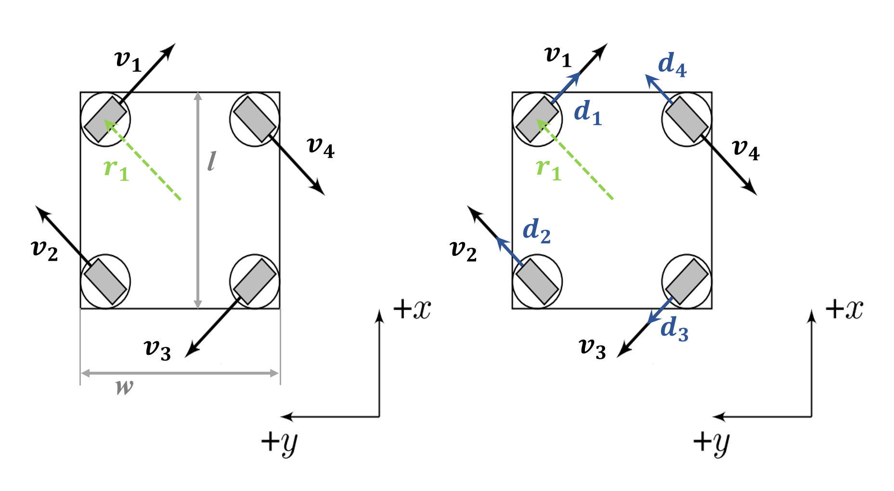
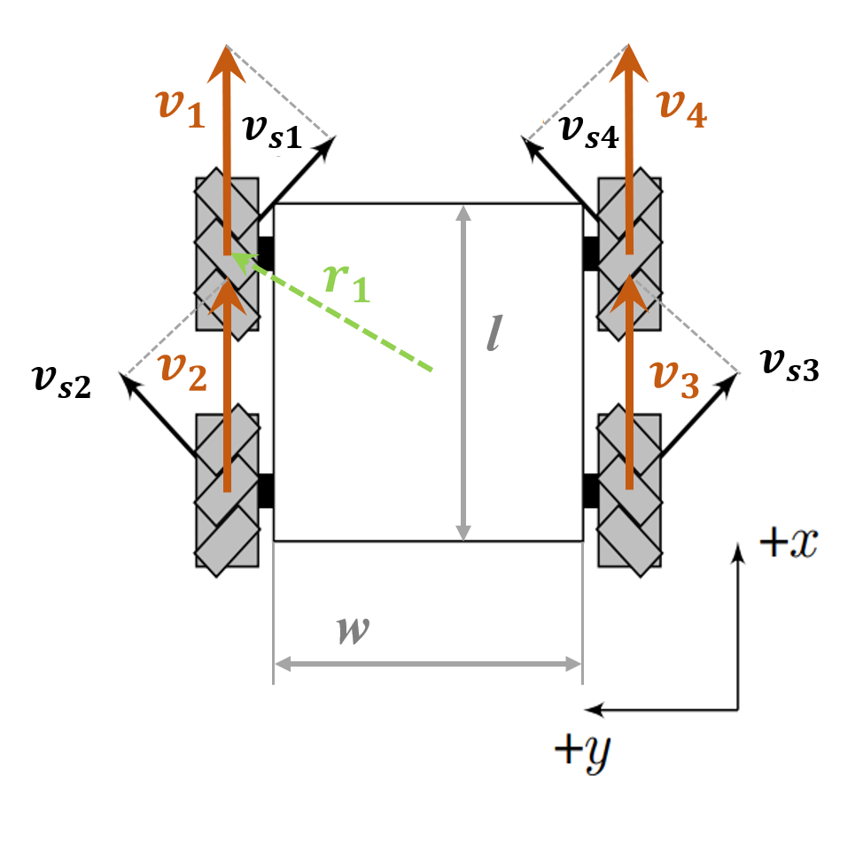

# 底盘逆运动学算法组件（舵轮/麦轮）

  

## 快速开始

组件源码仓库地址：<https://github.com/ZJU-HelloWorld/HW-Components>

要在项目中使用该组件，需添加仓库内的以下文件：

```
Algorithms/chas_ik_solver.c
Algorithms/chas_ik_solver.h
Utils/user_utils.h
system.h
typedef.h
```

### 使用前准备

逆运动学解算模块涉及 `CMSIS-DSP` 矩阵运算、三角函数等操作，使用前需要做以下准备：

* 添加源文件, 包含头文件路径
* 添加预处理宏以开启浮点运算单元（FPU）
* 在使用 STM32CubeMX 生成项目时，请在 `Code Generator` 界面 `Enable Full Assert`，来帮助断言算法中的错误
* 在 `system.h` 中 `system options: user config` 处进行系统设置

### 示例

首先在求解器头文件 `chas_ik_solver.h` 中输入相关参数，例如：

```c
/* reduction ratio of driving motor */
#define DRV_MOTOR_REDUCTION_RATIO (1.0f / 14.0f)
/* chassis parameters */
#define WHEEL_DIAM_M 0.1f
#define WHEEL_BASE_M 0.4f
#define TRACK_M 0.3f
/* angle bias: wheel module to chassis */
#define PSI_FL 0.0f
#define PSI_BL 0.0f
#define PSI_BR 0.0f
#define PSI_FR 0.0f
```

在项目中引用头文件：

```c
#include "chas_ik_solver.h"
```

实例化一个求解器并初始化：

```c
/* STEP1.a swerve drive */
ChasIkSolver_t solver;
ChasIkSolverInit(&solver, SWERVE, true);

/* STEP1.b mecanum */
ChasIkSolver_t solver;
ChasIkSolverInit(&solver, MECANUM, true);
```

设置参数并求解：

```c
/* STEP2 set chassis motion command */
solver.setCmd(&solver, vx_mps, vy_mps, vw_radps);

/* STEP3.a swerve drive */
solver.ikSolve(&solver, (float *)&cur_str_angle_rad, (float *)&tar_str_angle_rad, (float *)&tar_drv_spd_rpm);

/* STEP3.b mecanum */
solver.ikSolve(&solver, NULL, NULL, (float *)&tar_drv_spd_rpm);
```

### 组件说明

#### `ChasIKSolver` 类

参数

| 名称 | 类型 | 示例值 | 描述                                       |
| :------------------- | :------------------- | :--------------------- | :----------------------------------------- |
| `type`               | `ChassisType_e`      | `SWERVE`<br>`MECANUM`  | 底盘类型                                   |
| `opt`                | `bool`               | `true`<br>`false`      | 舵轮优化开启标识                           |
| `cmd.vx`             | `float`              | 1.0                    | $x$ 方向（前后）目标速度，单位：m/s  |
| `cmd.vy`             | `float`              | 1.0                    | $y$ 方向（左右）目标速度，单位：m/s |
| `cmd.vw`             | `float`              | 1.0                    | 绕 $z$ 轴目标转速，单位：rad/s       |

方法

| 名称               | 入参类型                                    | 出参类型 | 返回值 | 描述                                                         |
| :----------------- | ----------------------------------------------------------- | ------------------------ | :--------------------- | ------------------------------------------------------------ |
| `ChasIkSolverInit` | `ChasIKSolver_t*`<br>`ChassisType_e`<br>`bool`              | /                        | `void`                 | 用传入的参数初始化一个求解器。                               |
| `setCmd`           | `ChasIKSolver_t*`<br/>`float`<br/>`float`<br/>`float`       | /                        | `void`                 | 设置目标速度指令。                                           |
| `ikSolve`          | `ChasIKSolver_t*`<br>`float[4]`<br>`float[4]`<br>`float[4]` | `float[4]`<br>`float[4]` | `void`                 | 调用算法进行逆运动学求解。传入初始化后的求解器指针和运行时参数；解算结果将覆盖原地址内容。具体参数参见源码。 |

#### 运行时参数
| 名称 | 类型 | 示例值 | 描述                                       |
| :------------------- | :------------------- | :--------------------- | :----------------------------------------- |
| `cur_str_rad`        | `float[4]`           |                        | 当前航向电机角度（舵轮）           |
| `tar_str_rad`        | `float[4]`           |                        | 解算结果：航向电机目标角度（舵轮） |
| `tar_drv_rpm`        | `float[4]`           |                        | 解算结果：驱动电机目标转速         |


-------------------------------------------------------------

## 理论

根据给定的底盘 $x,y$ 方向上的目标平动速度分量和绕 $z$ 轴的目标旋转角速度分量，经逆运动学解算，能够得出：

* 四组航向电机的目标角度和对应的目标驱动轮速（舵轮）；
* 四个目标驱动轮速（麦克纳姆轮）。

完成逆运动学解算后，我们也可以对矩阵求（伪）逆以进行正运动学解算。

### 基本概念介绍

* **驱动电机（driving motor）** 驱动底盘移动。目前（2022赛季）型号为 M3508，反馈转子转速单位为 $\rm rpm$​；
* **航向电机（steering motor）** 是舵轮轮组中负责改变驱动轮朝向的电机。目前（2022赛季）型号为 GM6020，编码器反馈机械转子刻度 0 ~ 8191，程序中线性映射到 $-\pi$ ~ $0$ ~ $\pi$；

* 记**驱动电机减速比**为 $k$（原装 M3508 电机为3591 / 187）；
* 记**驱动轮直径**为 $d$，单位：$\rm m$；
* **轴距（wheelbase）** 即前后轮轴间距离，记为 $l$，单位：$\rm m$；
* **轮距（track）** 即左右驱动轮中心距离，记为 $w$，单位：$\rm m$；
* **麦轮及其动力学特性**
    * 为实现全向移动，麦轮一般4个一组使用，其中左旋轮和右旋轮各2个，呈手性对称；麦轮的安装方式呈 X 或 O 型，一般（2022赛季）采取 O 型安装。
    * 麦轮上的辊子轴线与轮毂轴线夹角为 45°。在轮毂旋转时，与地面接触的辊子和地面相互作用，为底盘运动提供力矩。
    * 麦轮的运动可以分解为辊子的滚动和滑移，两者合成麦轮的合速度。[戳这里看运动效果](https://mmbiz.qpic.cn/mmbiz_gif/emUnIU9NLria5HtnE2ujTguj4OUKfuf9iboeMu6Qpohx9MNcww2U7ibXBcXLlmdajMwN63Bl6JdibnicoHicYvU8bwhw/640?wx_fmt=gif&wxfrom=5&wx_lazy=1)

> **说明1：** X 和 O 表示四轮与地面接触的辊子所形成的图形，如[图4](#麦轮)所示，该图为俯视图，可推知其辊子与地面接触的情况，为 O 型。
>
> **说明2：**辊子受地面的反作用，在垂直于其轴线方向上产生滚动，滚动速度由轮毂速度和底盘上其他麦轮的运动共同影响；该运动是被动的，无法为底盘移动提供力矩。在轮毂的驱动作用下，辊子在平行于其轴线方向上产生滑移，滑移速度仅与轮毂速度相关；该运动是主动的，辊子受地面反作用力进而驱动底盘。

### 坐标系定义和旋转矩阵

对本文中所有坐标系，绕坐标轴逆时针旋转（CCW）为正（右手定则）。

由 GM6020 电机的特性和我们之前的定义，可知其角度零位对应码盘值 4096，此时定义电机（定子）坐标系，转子朝向向量指向 $x^+$。图1所示情况电机角度约为 ${2\over3}\pi\ \rm rad$。

> **说明：**转子朝向向量在电机实体上可描述为：由电机中轴指向销孔中心的方向向量。

<figure markdown>
  {width=200}
  <figcaption>图1 GM6020 电机坐标系</figcaption>
</figure>

记底盘坐标系为$\{O\}$，如图2. 

<figure markdown>
  {width=500}
  <figcaption>图2 舵轮和麦轮坐标系及舵轮轮组坐标系</figcaption>
</figure>

对于舵轮底盘，记轮组坐标系为 $\{M_i\}$ ，其中$i=1,2,3,4$，分别对应 front left (FL), back left (BL),  back right (BR), front right (FR) 四组模块。以 FL 模块为例，其坐标系如图2左所示。实际解算过程中，还需要得到由 $\{O\}$ 到 $\{M_i\}$ 的旋转矩阵，记为 ${^{M_i}_O}R$ . 将该矩阵左乘于一向量 $^OP$，可得到该向量在 $\{M_i\}$ 中的描述：

$$
\begin{align}
^{M_i} P = {^{M_i}_O}R\  ^{O}P
\end{align}
$$

### 运动状态表示

#### 舵轮轮组

<figure markdown>
  {width=500}
  <figcaption>图3 舵轮底盘俯视图</figcaption>
</figure>

对每个轮组，用一个向量 $\boldsymbol V_i$ 表征其运动状态（如图3左）：

* 该向量指向航向电机的朝向，驱动轮转动方向与该朝向共线（可以正反转）。<u>在不考虑优化的前提下，默认驱动轮转动方向与 $\boldsymbol V_i$ 同向</u>；

* 向量的模长对应驱动轮线速率。

则轮组运动状态可表示为：

$$
\begin{align}
^O\boldsymbol V_i=
\begin{bmatrix}
v_{xi}\\ 
v_{yi}\\
0
\end{bmatrix}
\end{align}
$$

> **说明1：**驱动轮转动方向与 $\boldsymbol V_i$ 同向时，将驱动电机的转速定义为正，这里涉及到实际电机方向的标定。
>
> **说明2：**航向电机和驱动电机均能够正反360°旋转，这意味着每一种轮组运动状态均至少有两个解，对应航向电机角度和驱动轮转动方向的不同组合（如图3右，其中 $\boldsymbol d_i$ 指向航向电机的朝向）。现实世界中我们需要按一定策略选择更优的的那个，来保证底盘运动更为鲁棒和流畅。对优化的具体说明见[1.5.3 节](#舵轮轮组运动优化)。

#### 麦轮

<figure markdown>
  {width=300}
  <figcaption>图4 麦轮底盘俯视图</figcaption>
</figure>

对每个驱动轮，用一个向量 $\boldsymbol V_i$ 表征其运动速度（如图4）：

* 该向量指向驱动轮<u>运动</u>方向（辊子滚动速度和滑移速度的合速度，并非驱动轮的<u>转动</u>方向）；
* 向量的模长对应在<u>运动</u>方向上的线速率。

则轮组运动速度可表示为：

$$
\begin{align}
^O\boldsymbol V_i=
\begin{bmatrix}
v_{xi}\\ 
v_{yi}\\
0
\end{bmatrix}
\end{align}
$$

该速度可分解为辊子的滚动速度和滑移速度，滑移速度分量用 $v_{si}$ 表示，其符号指示滑移方向。由麦轮的结构和动力学特性可得

$$
v_{si}=
\ 
^O\boldsymbol V_{i}
\cdot
\boldsymbol {\hat e_i}
$$

其中 $\boldsymbol {\hat e_i}$ 为指向滑移正方向的单位方向向量。

由麦轮的结构和动力学特性可知，滑移速度和驱动轮转速有清晰的一一对应关系。由滑移速度可解出驱动轮转速，反之亦然。

> **说明：**驱动轮转动方向指向 $x^+$ 时，将驱动电机的转速定义为正，这里涉及到实际电机方向的标定；此时将对应的滑移速度分量指向的方向定义为滑移正方向。


### 逆运动学解算算法

#### 通用部分

给定 $\{O\}$ 下底盘的目标平动速度 $\boldsymbol v$ 和绕 $z$ 轴的旋转角速度 $\boldsymbol \omega$，记为 $^O\boldsymbol V=[v_x\ v_y\ \omega]^{\mathrm T}$. 将底盘旋转中心指向轮（组） $i$ 中心的位矢记为 $^O\boldsymbol R_i=[r_{xi}\ r_{yi}\ 0]^{\mathrm T}$. 

>**注意：**底盘旋转中心不一定是底盘的几何中心。目前（2022赛季），我们将底盘旋转中心定义在几何中心上。

> **说明：**由模型可以读出 $l$ 和 $w$. 各轮（组）相对旋转中心的位矢如下：
>
> |       | FL    | BL     | BR     | FR     |
> | ----- | ----- | ------ | ------ | ------ |
> | $r_x$ | $l/2$ | $-l/2$ | $-l/2$ | $l/2$  |
> | $r_y$ | $w/2$ | $w/2$  | $-w/2$ | $-w/2$ |

对于每个轮（组），平动分量仍为 $\boldsymbol v$ . 可得

$$
\begin{align}
^O\boldsymbol V_i=
{\boldsymbol v}+{\boldsymbol \omega} \times  {^O{\boldsymbol R_i}}
\end{align}
$$

将 $\boldsymbol \omega$ 定义为 $[0\ 0\ \omega]^{\mathrm T}$，对应的叉乘变换矩阵

$$
\boldsymbol S=
\begin{bmatrix}
0 & -\omega & 0\\
\omega & 0 & 0\\
0 & 0 & 0\\
\end{bmatrix}
\\
{\boldsymbol \omega} \times  {^O{\boldsymbol R_i}} 
= \boldsymbol S \ {^O{\boldsymbol R_i}}
$$

故得

$$
^O\boldsymbol V_i=
\begin{bmatrix}
v_x \\ 
v_y \\
0
\end{bmatrix}
+
\begin{bmatrix}
0 & -\omega & 0\\
\omega & 0 & 0\\
0 & 0 & 0\\
\end{bmatrix}
\begin{bmatrix}
r_{xi} \\
r_{yi} \\ 
r_{zi} 
\end{bmatrix}=
\begin{bmatrix}
v_x - r_{yi}\omega \\ 
v_y + r_{xi}\omega\\
0 
\end{bmatrix} =
\begin{bmatrix}
1 & 0& -r_{yi}\\ 
0 & 1& r_{xi}\\ 
0 & 0 & 0 \\ 
\end{bmatrix}
\begin{bmatrix}
v_x \\ 
v_y \\
\omega 
\end{bmatrix}
$$

至此，我们得出了指定底盘运动状态下各轮（组）的目标运动状态描述。

#### 舵轮应用

应用上述通用算法，<u>暂不考虑优化</u>，我们尝试计算舵轮执行机构的相关参数。给出以下信息：

* 目前（2022赛季）航向电机安装方式为转子朝下；
* 认为 $oxy$ 平面平行于  $m_ix_iy_i$ 平面，则 $m_ix_i$ 相对 $ox$ 在平面上的夹角可在模型中读出，记为 $\psi_i$，单位：$\rm rad.$ 


可确定旋转矩阵：

$$
{^{M_i}_O R}
= 
\begin{bmatrix}
c\psi_i\   &-s\psi_i\   &0\\
s\psi_i\   &c\psi_i\    &0\\
0\       &0\        &1\\
\end{bmatrix}

\begin{bmatrix}
1\   &0\   &0\\
0\   &-1\  &0\\
0\   &0\   &-1\\
\end{bmatrix}
=
\begin{bmatrix}
c\psi_i\   &s\psi_i\   &0\\
s\psi_i\   &-c\psi_i\    &0\\
0\       &0\        &-1\\
\end{bmatrix}
$$

则有

$$
^{M_i} \boldsymbol V_i =
{^{M_i}_O}R \ ^O\boldsymbol V_i
\triangleq
\begin{bmatrix}
^{M_i}v_{xi}\\ 
^{M_i}v_{yi}\\
0
\end{bmatrix}
$$

可以进一步计算：

* **航向电机角度** $^{M_i}\theta_i$，单位：$\rm rad$.

  $$
  ^{M_i}\theta_i={\mathrm{atan2}\ }(^{M_i}v_{yi},\ ^{M_i}v_{xi})
  $$

> **注意：**请注意 `atan2` 函数的正确含义。当速度指令全为 0 时，需要为其补充定义。目前（2022赛季），我们将此时的 $^{M_i}\theta_i$ 定义为与仅有旋转分量 $\omega$ 时解算出的角度一致。

* **轮线速度** $\boldsymbol v_i$，单位：$\rm m/s$（不考虑优化则方向与航向电机朝向一致，关于其方向的确定见[优化部分](#舵轮轮组运动优化)）
  $$
  ||\boldsymbol v_i||=\sqrt{^{M_i}v_{xi}^2\ +\ ^{M_i}v_{yi}^2}
  $$

* **驱动电机转速** $\boldsymbol n_i$，单位：$\rm rpm$（解释同上）
  $$
  ||\boldsymbol n_i||=
  \frac 1k
  \cdot
  \frac{60}{2\pi}
  \cdot
  {\frac 2{d}}
  \cdot
  ||\boldsymbol v_i||
  $$

#### 麦轮应用

应用上述通用算法，我们尝试计算麦轮执行机构的相关参数。滑移速度

$$
v_{si}=
\ 
^O\boldsymbol V_{i}
\cdot
\boldsymbol {\hat e_i}
=
\begin{bmatrix}
v_x - r_{yi}\omega \\ 
v_y + r_{xi}\omega\\
0 
\end{bmatrix}
\cdot
\begin{bmatrix}
\hat e_{xi}\\ 
\hat e_{yi}\\ 
0 
\end{bmatrix}
=
\hat e_{xi} v_x +
\hat e_{yi} v_y +
(\hat e_{yi}r_{xi} - \hat e_{xi}  r_{yi})\omega
$$

> **说明：**参考[图4](#麦轮)，可得
>
> |            | FL           | BL          | BR           | FR          |
> | ---------- | ------------ | ----------- | ------------ | ----------- |
> | $\hat e_x$ | $\sqrt2/ 2$  | $\sqrt2/ 2$ | $\sqrt2/ 2$  | $\sqrt2/ 2$ |
> | $\hat e_y$ | $-\sqrt2/ 2$ | $\sqrt2/ 2$ | $-\sqrt2/ 2$ | $\sqrt2/ 2$ |
>
> ​			以上 $\hat e_z=0$.

可以进一步计算：

* **轮线速度** $\boldsymbol v_i$，单位：$\rm m/s$；滑移速度由轮线速度正交分解得到，而两向量夹角为 $\phi =\pi / 4$，故有

  $$
  v_i={ v_{si} \over \cos \phi}=
  \sqrt 2\ 
  [
  \hat e_{xi} v_x +
  \hat e_{yi} v_y +
  (\hat e_{yi}r_{xi} - \hat e_{xi}  r_{yi})\omega
  ]
  $$

经计算，列出四轮线速度：

$$
\begin{bmatrix}
v_1\\ 
v_2\\ 
v_3\\
v_4
\end{bmatrix}
=
\begin{bmatrix}
1 & −1 & −r_{x1} - r_{y1}\\
1 & 1  & r_{x2} - r_{y2}\\
1 & −1 & −r_{x3} - r_{y3}\\
1 & 1  & r_{x4} - r_{y4} \\
\end{bmatrix}
\begin{bmatrix}
v_x \\ 
v_y \\
\omega 
\end{bmatrix}
$$

> **说明：**麦轮代码实现中我们可以直接套用线速度公式，不必再进行完整的解算。

* **驱动电机转速** $n_i$，单位：$\rm rpm$.
  $$
  n_i=
  \frac 1k
  \cdot
  \frac{60}{2\pi}
  \cdot
  {\frac 2{d}}\cdot\ 
  v_i
  $$

### 运动优化

#### 标准化

当解算出某个轮组所需的驱动电机转速大于其额定转速（或在当前负载下所能达到的最高转速），则需要对底盘上的所有电机进行转速限制，即共同乘以一限制系数，以避免底盘失控。设转速上限为 $n_{\max}$，系数

$$
p=\frac {n_\max}{\max_{i}\{n_i\}}
$$

> **说明：**底盘功率限制机制也涉及转速限制，但情况与上述有所不同，具体请参考功率限制方案文档。

#### 舵轮平动和旋转的权衡

需要注意平动和旋转分量的比例关系：

* 确定策略，陀螺躲避攻击优先 or 机动性优先，设置合理的运动指令；
* 随动模式下，底盘对云台的跟随存在余差，因此旋转分量指令必然始终存在；当平动分量较小时，解算出的航向电机角度可能剧烈变化。因此，对于此情况需要适当设定死区，使航向电机的角度仅由平动指令解算得到，以避免不期望的抖动。

#### 舵轮轮组运动优化

[1.3.1节](#舵轮轮组)对逆运动学解的优化做出了简单的说明。事实上，对轮组运动的优化出于以下几点考量：

* 航向电机旋转时，将给车身一个扭矩；若航向电机相对旋转角度较大，可能导致车身不期望的偏转或偏移；
* 对于航向电机未收敛到目标位置的轮组，若其驱动轮若具有一定的速度，则可能使底盘运动不受控（若所需旋转角度较大，则意味着更慢收敛到期望的位置上）。

因此，优化的目标如下：

* 将航向电机的相对旋转角度限定在一定范围内；
* 对于未收敛到正确角度的轮组，削减其驱动电机转速。

思路如下：

1. 完成基础解算后，得到驱动电机转速 $n_i$ ；计算航向电机目标角度与当前角度 $\theta_i$ 的差 ${\delta_i}$；
2. 若$|{\delta}_i|>\pi/2$ ，将目标角度 $+\pi\ \rm rad$ 后限制在 $[\theta_i-\frac{\pi}2,\theta_i+\frac{\pi}2)$，否则目标角度不变；记处理后的目标角度与当前角度的差为 ${\delta'_i}$；
3. 若$|{\delta}_i|>\pi/2$ ，<u>驱动电机转速取反</u>，否则不变；记处理后的转速为 $n_i'$；
4. 确定驱动电机转速限制函数 $f(\delta'_i)$ ，限制后的最终转速为 $f(\delta'_i)\cdot n_i'$。

> **说明：**驱动电机转速限制函数 $f(\delta'_i)$ 需满足以下条件：
>
> * $\forall {\delta'_i}\in[-\frac{\pi}2,\frac{\pi}2),0 \leq f(\delta'_i)\leq1$.
> * $f(0) = 1$.
> * 在 $[-\frac{\pi}2,0)$ 和 $[0,\frac{\pi}2)$ 上对称.

有一个函数很好地符合以上条件，即 $\cos \alpha$。我们发现当$|\alpha|>\pi/2$，$\cos \alpha$ 同样能给出一个对应的限制系数，只是符号为负，这恰好对应了思路第3点“驱动电机反转”。因此，我们可以将思路第3、4点合并为：**计算 $\cos \delta_i$，确定经削减和调整方向后的最终驱动电机转速为 $n_i' = \cos \delta_i\cdot n_i$.**

除此之外，我们还可以选取 $\cos^3 \alpha$ 等函数来实现更严格的限制。 

> **例：**[一个例子](https://dominik.win/blog/res/swerve/stray_module_cos.mp4)，其中黑色箭头指示航向电机方向，蓝色箭头为 $\cos$ 方案，绿色箭头为 $\cos^3$ 方案$^{[2]}$.

#### 舵轮驻车和刹车

驻车时，航向电机角度与小陀螺旋转时一致，以保证底盘位置的稳固。

刹车阶段（操作手无指令），当驱动轮速降至较低时，再切入驻车模式；这种策略能够减小对机械结构的冲击，并保证底盘运动的平稳。


## 参考资料

[1] <https://file.tavsys.net/control/controls-engineering-in-frc.pdf> （一位 FRC Mentor 编写的技术手册，包含详细的运动学解算和其他技术介绍）

[2] <https://dominik.win/blog/programming-swerve-drive> （个人开发者的优化思路提示）

[3] 克雷格.  机器人学导论.  北京 : 机械工业出版社, 2018.
