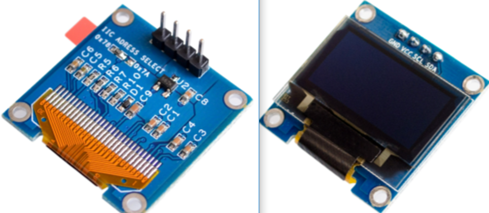
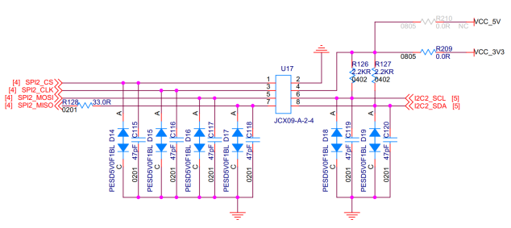
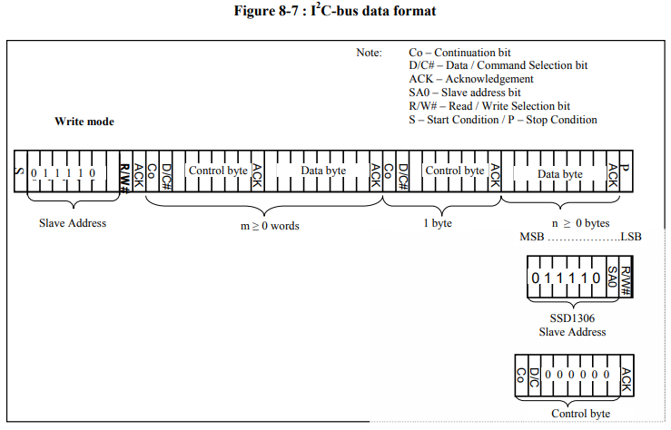
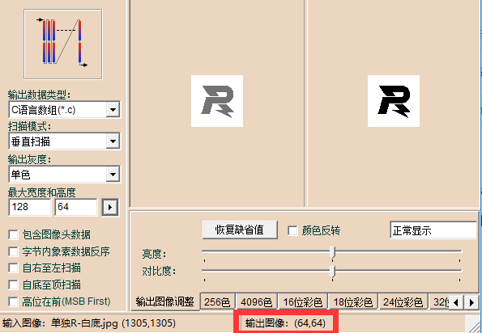

# OLED 设备组件

  <sp>  

## 理论

OLED 即有机发光管（Organic Light-Emitting Diode，OLED）或有机电激光显示（Organic Electroluminescence Display）。OLED 显示技术具有自发光、广视角、几乎无穷高的对比度、较低功耗、极高反应速度、可用于绕曲性面板、使用温度范围广、构造及制程简单等优点，被认为是下一代的平面显示屏新兴应用技术。OLED 显示和传统的 LCD 显示不同，其可以自发光，所以不需要背光灯，这使得 OLED 显示屏相对于 LCD 显示屏尺寸更薄，同时显示效果更优。

实车上 OLED 模块可用于显示关键信息、指示设备状态等场景。常用的 OLED 屏幕有蓝 /黄色、白色等几种，屏幕尺寸通常为 0.96 寸，分辨率 128 * 64，支持 SPI、I2C 等通信协议。实验室使用的 OLED 模块引出接口为 I2C，驱动芯片型号为 SSD1306，如下图所示：



I2C 是一种半双工、双向二线制（数据线 SDA，时钟线 SCL）同步串行总线，总线允许挂载多个主设备，但总线时钟同一时刻只能由一个主设备产生，并且要求每个连接到总线上的器件都有唯一的 I2C 地址，从设备可以被主设备寻址。

> 以 RoboMaster 开发板 C 型为例，板上的用户 I2C 接口原理图和实物图如下图所示：
>
> 
>
> 
>
> 对应的外设接口为 `I2C2`，SDA 对应引脚为 PF0，SCL 对应引脚为 PF1。

### 主要驱动原理

> 上述模块的 I2C 设备默认地址为 `0x78`.

我们通过 I2C 总线向 OLED 模块写指令和数据，使用 HAL 库封装的硬件 I2C；对于大量数据传输，开启 DMA 传输模式。通信协议如下图所示：



在发送从机地址之后，首先发送一个控制字节（由 Co、D/C# 位和 6 个 “0” 组成）。
 
* 如果 Co 位设置为逻辑 “0”，则此后通过 I2C 传输的信息全部为数据字节，即不需要再发送控制字节，直到本次传输结束。
 
* D/C# 位确定下一个数据字节用作命令或数据。如果 D/C# 位设置为逻辑 “0”，将以下数据字节定义为命令。如果 D/C# 位设置为逻辑 “1”，则将以下数据字节定义为将要存储在 GDDRAM 中的数据。每次数据写入后，GDDRAM 列地址指针将自动增加1。

简而言之：

* 发送 `0x00 + ...` 持续写入指令信息；
 
* 发送 `0x80 + 0x..` 单次写入指令信息；
 
* 发送 `0x40 + ...` 持续写入数据信息；
 
* 发送 `0xC0 + 0x..` 单次写入数据信息。

------------------------

在驱动 OLED 模块时，我们不去读取其显存（Graphic Display Data RAM, GDDRAM）的内容，而是在 STM32 中开辟一块大小相同的内存（8 pages * 128 bytes）作为 GDDRAM 映射的画板，完成操作后，使用持续写数据格式指令，将全部数据一次性写入 OLED 模块。GDDRAM 的结构如下图所示：


当一个数据字节被写入 GDDRAM 时，当前列（SEG，程序中写为 COL）同一页（PAGE）的所有行（COM，程序中写为 ROW）图像数据都被填充（即由列地址指针指向的当前页整列 8 bit 数据被一次性填充）。数据位 D0 被写入顶行，数据位 D7 被写入底行。


SSD1306中有三种不同的存储器寻址模式：页寻址模式（`0x02`）、水平寻址模式（`0x00`）和垂直（`0x01`）寻址模式。`0x20, 0x02 / 0x00 / 0x01` 时序组合命令将内存寻址方式设置为上述三种模式之一。由于我们需要一次性对整个显存进行操作，因此采取了对大面积读写而言更方便的**水平寻址**模式，该模式下：

* 读 / 写 GDDRAM 后，列地址指针自动增加 1；
 
* 如果列地址指针到达列结束地址，则列地址指针重置为列起始地址，页地址指针自动增加 1；
 
* 当列和页地址指针都到达结束地址时，指针将重置为列起始地址和页起始地址。如下图所示：


> 更多设备相关信息和指令含义可参考资料[2]：SDD1306 数据手册。

------------

在生成字符或图标数据时，要求采取垂直扫描模式，从左至右，自顶至底，生成常量数组并按组件要求写入结构体。在组件中实现的 GDDRAM 映射画板不存在 “page” 的概念，这意味着一列数据最多可以有 64 bits。

可使用 `bmp2lcd` 软件生成字节数据 [下载](https://g6ursaxeei.feishu.cn/wiki/wikcnPOJ639qdTBPh0ucMcRcCDg)，例如：


 
注意其输出大小为 64 * 64，对应了后续图标结构体中的 width 和 height 参数。

## 快速开始

组件源码仓库地址：<https://github.com/ZJU-HelloWorld/HW-Components>

要在项目中使用该组件，需添加仓库内的以下文件：

```
Devices/dev_oled.c
Devices/dev_oled.h
Devices/dev_config.h
system.h
```

### 外设驱动配置

例如将上述 OLED 模块通过 8-Pin 牛角接插件连接至 RoboMaster 开发板 C 型 `I2C2` 接口，外设驱动流程如下：

* 配置 I2C 模式，设置主机特性，其中速率模式为 `Fast Mode`，时钟频率 `400 KHz`；
* 使能 DMA 发送以减小 CPU 占用；


### 使用前准备

使用前需要做以下准备：

* 在使用 STM32CubeMX 生成项目时，请在 `Code Generator` 界面 `Enable Full Assert`，来帮助断言设备驱动中的错误；在 `main.c` 中修改 `assert_failed` 函数以指示断言结果，如添加 `while(1);`
* 在 `system.h` 中 `system options: user config` 处进行系统设置
* 在 `dev_config.h` 中设置 `Conditional Compiling` 选项，将使用到的设备对应的条件编译宏开关定义为 1.

### 示例

在项目中引用头文件：

```c
#include "dev_config.h"
```

实例化一个 OLED 设备，指定显示方向选项并初始化，默认开启显示，如：

```c
Oled_t oled;
OledInit(&oled, &HI2C_OLED, OLED_NORMAL); // OLED_NORMAL - 正; OLED_REMAP - 倒
```

生成所需的图标字节数据，指定其宽度、高度，创建需要显示的图标结构体，例如：

```c
static const uint8_t kCheckBoxOnlineDta[12 * 12] = {
    0x00, 0x00, 0x7F, 0xE0, 0x40, 0x20, 0x43, 0x20, 0x41, 0xA0, 0x40, 0xE0,
    0x43, 0xA0, 0x4F, 0x20, 0x5C, 0x20, 0x70, 0x20, 0x7F, 0xE0, 0x00, 0x00,
    /* 12 X 12 */
};
static const OledIcon_t kCheckBoxOnline = {
    .height = 12,
    .width = 12,
    .data = (uint8_t*)kCheckBoxOnlineDta};
```

> 在组件中还提供了 `kCheckBoxOffline`、`kBatteryBox`、`kRmLogo` 以及 `kAscii1206`（12 * 6 大小的 ASCII 字符）可供调用。

建议每次操作内存映射的画板前调用 `clear` 方法进行清空。使用给出的方法添加点、线、图标、字符或字符串，如：

```c
oled.clear(&oled);
oled.genIcon(&oled, 0, 0, &kRmLogo);
oled.printf(&oled, 60, 26, "%s", "HelloWorld!");
```

完成操作后，将数据一次性写入显存：

```c
oled.refresh(&oled);
```

### 注意

1. 请不要频繁调用能够开关屏显的方法，如 `OledInit`, `displayOn`, `displayOff` 等；
2. 经测试，以 40Hz 频率调用 `refresh` 方法，DMA 能够正常工作而不进入 `HAL_BUSY` 状态。更高频率下 DMA 将出现丢包现象（但并不影响信息显示，实测 1KHz 依然能够刷新显示）。
3. 当图像较大时，`genIcon` 方法将花费几毫秒的时间。因此，若需要展示图像，请提前 Generate；若图像需要实时变化，请尽可能提前 Generate 静态部分，并将调用方法的线程的优先级尽量降低。
4. 由于 OLED 硬件初始化需要一段时间，请在 STM32 启动 **30ms** 后再调用 OLED 对象初始化函数，否则初始化函数将返回 `DEV_NOSTATE`. 初始化后，方可安全地调用方法。
5. I2C 通信异常中断后（如异常终止 Debug、烧录代码等可能触发）将不能恢复正常工作，请重启电源。

### 组件说明

#### `Oled` 类

参数

| 名称     | 类型                 | 示例值        | 描述     |
| :------- | :------------------- | :------------ | :------- |
| `hi2c` | `I2C_HandleTypeDef*` | &hi2c2     | 与 OLED 通信的 I2C 总线 |
| `gram` | `OledGram_t` | / | GDDRAM 在 STM32 内存中映射的画板结构体 |

方法

| 名称 | 参数说明                                                     | 描述                                  |
| :------------------  | :-----------------------------------------------------------| ------------------------------------- |
| `OledInit`      | 传入 I2C 句柄指针、GRAM 结构体指针              | 用传入的参数初始化一个 OLED 设备。 |
| `displayOn`          | 根据 DMA 传输状态，返回设备状态类型 `DevStatus_t`            | 开启 OLED 屏显。                                             |
| `displayOff`         | 根据 DMA 传输状态，返回设备状态类型 `DevStatus_t`            | 关闭 OLED 屏显。                                             |
| `refresh`            | 根据 DMA 传输状态，返回设备状态类型 `DevStatus_t`            | 将数据写入 GDDRAM，刷新显示。                                |
| `clear`              | /                                                            | 清空内存中映射的画板。                                       |
| `inverse`            | /                                                            | 将内存中映射的画板反色。                                     |
| `genPoint`           | 指定画笔类型 `Pen_t pen`，然后传入点坐标 (x, y)，x 代表第 x 列，y 代表第 y 行 | 用指定的笔刷改变画板上的一点。                               |
| `genLine`            | 传入点坐标 (x1, y1) (x2, y2)，标识线段的起点和终点           | 在画板上绘制一条线段。                                       |
| `genIcon`            | 传入点坐标 (x, y)，标识图标左上角起点；传入图标结构体常量的指针 | 在画板上绘制一个图标。                                       |
| `putChar`            | 传入点坐标 (x, y)，标识字符左上角起点；传入一个字符         | 在画板上输出一个字符。                                       |
| `puts`               | 传入点坐标 (x, y)，标识字符串左上角起点；传入字符串常量的指针 | 在画板上输出一串字符，遇边界换行。                           |
| `putPrintf`          | 传入点坐标 (x, y)，标识字符串左上角起点；传入格式标签，然后紧跟需要被格式化的字符串 | 在画板上输出一串格式化字符，遇边界换行，最大长度为 128 字节。 |

#### 运行时参数

运行时传入的相关参数。

| 名称 | 类型 | 示例值                              | 描述                     |
| :------------------- | :------------------- | :---------------------------------- | :----------------------- |
| `pen`                | `OledPen_t`          | PEN_CLEAR<br>PEN_WRITE<br>PEN_INVER | 对一个点，选择笔刷类型。 |
| `dir`                | `OledDirection_t`    | OLED_NORMAL<br>OLED_REMAP           | OELD 显示方向。          |

#### `OledGram` 结构体

| 名称 | 类型 | 示例值                               | 描述                               |
| :------------------- | :------------------- | :----------------------------------- | :--------------------------------- |
| `gram_cmd`           | `OledCtrlType_t`    | OLED_CMD<br>OLED_ONE_CMD<br>OLED_DTA | 控制字节类型。                     |
| `gram_data`          | `uint8_t[8][128]`    | /                                    | GDDRAM 在 STM32 内存中映射的画板。 |

#### `OledIcon` 结构体

| 名称 | 类型 | 示例值 | 描述                |
| :------------------- | :------------------- | :----- | :------------------ |
| `width`              | `uint16_t`           | 64     | 图标宽度（1 ~ 128） |
| `height`             | `uint16_t`           | 32     | 图标高度（1 ~ 64）  |
| `data`               | `unit8_t*`            | /      | 图标数据数组指针    |

> **内置图标和字模：**
>
> `kCheckBoxOnline` - 设备在线框（12 * 12）
>
> `kCheckBoxOffline` - 设备离线框（12 * 12）
>
> `kBatteryBox` - 电池框（25 * 14）
>
> `kRmLogo` - RoboMaster 徽标（64 * 64）
>
> `kAscii1206` ASCII 字符（6 * 12）

## 附录

### 版本说明

| 版本号                                                       | 发布日期   | 说明           | 贡献者 |
| ------------------------------------------------------------ | ---------- | -------------- | ------ |
|  | 2022.12.09 | 发布 OLED 组件 | 薛东来 |

### 参考资料

[1] RoboMaster 开发板 C 型嵌入式软件教程文档. [Github 仓库](https://github.com/RoboMaster/Development-Board-C-Examples)

[2] [SSD1306 数据手册](https://g6ursaxeei.feishu.cn/wiki/wikcn08m9EwNwlqWAOHRRjfoU6f?sheet=d062d7&range=QjI4)
