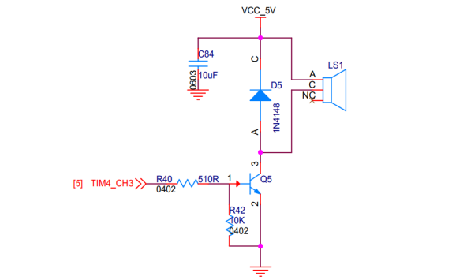
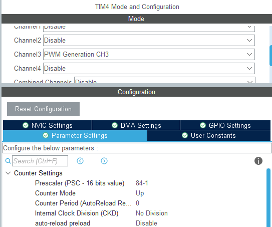

# 蜂鸣器（Buzzer）设备组件

 <sp>  

## 理论

蜂鸣器是一种能够通过电子信号控制的发声器件，能够为用户提供直观的声音信息，是一种常见的人机交互设备，实车上用于播放开机音乐，或进行警示、报错。

常见的蜂鸣器封装有插针型和贴片型，根据是否内置震荡电路可分为有源蜂鸣器和无源蜂鸣器。有源蜂鸣器只需提供直流电压，即可通过内部的震荡电路产生震荡电流进而鸣响；无源蜂鸣器则需要输入一定频率的方波来驱动，可以通过改变输入方波的频率发出不同音调的声音。

> 以 RoboMaster 开发板 C 型为例，使用的蜂鸣器为贴片型，原理图与实物图如下图所示：
>
> 
>
> 
>
> 对应的控制 IO 为 PD14，PWM 由定时器 `TIM4 CHANNEL3` 输出。

## 快速开始

组件源码仓库地址：<https://github.com/ZJU-HelloWorld/HW-Components>

要在项目中使用该组件，需添加仓库内的以下文件：

```
devices/dev_buzzer.c
devices/dev_buzzer.h
devices/dev_config.h
system.h
```

### 外设驱动配置

在使用 PWM 波控制蜂鸣器时，使用 CubeMX 配置时将对应定时器预分频至 1MHz，以方便控制。例如对于RoboMaster 开发板 C 型板载的蜂鸣器，驱动流程如下：

* 对于 TIM4，查看数据手册可知其挂载在 APB1 总线上，时钟频率 84MHz，为达到 1MHz 需要 84 分频 ，因此将预分频值（Prescaler）设置为 83；
* 工作频率与鸣响音调相关，因此重载值（Counter Period）在运行时由指定的音调频率计算得到，设频率 $f$，则重载值为 $1000000 / f-1$，CubeMX 配置可随意；
* 高电平时间即脉宽（Pulse）与鸣响强弱相关，可在组件运行时更改输出不同占空比的方波，来控制声音的强弱，CubeMX 配置可随意。



### 使用前准备

使用前需要做以下准备：

* 在使用 STM32CubeMX 生成项目时，请在 `Code Generator` 界面 `Enable Full Assert`，来帮助断言设备驱动中的错误；在 `main.c` 中修改 `assert_failed` 函数以指示断言结果，如添加 `while(1);`
* 在 `system.h` 中 `system options: user config` 处进行系统设置
* 在 `dev_config.h` 中设置 `Conditional Compiling` 选项，将使用到的设备对应的条件编译宏开关定义为 1

### 示例

在项目中引用头文件：

```c
#include "dev_config.h"
```

实例化一个蜂鸣器设备并初始化，默认失能，如：

```c
Buzzer_t buzzer;
BuzzerInit(&buzzer, &HTIM_BUZZER, HTIM_CH_BUZZER);
```

指定每个音符的时长和整体强度 $\in (0,1]$（数值太小可能无法正常播放），编写需要播放的音符列表（类型 `Tune_t`，音符表示如 `A4_`：基本音，`A4S`：升，`A4F`：降，`RST`：休止），以 `EOL` (end of list) 结尾，例如：

```c
const TuneList_t kWarningList1B = {
    .tune_duration_ms = 500,
    .dynamic_intensity_scale1 = 1.0f,
    .list = {A4_, RST, EOL}
};
```

指定单次或循环播放选项，开始播放：
	
=== "单次播放"
    ```c
    buzzer.play(&buzzer, &kWarningList1B, PLAY_ONCE);
    ```

=== "循环播放"	
    ```c
    buzzer.play(&buzzer, &kWarningList1B, PLAY_LOOP);
    ```

在播放过程中，需要不断调用 `ctrlHook` 方法来控制音符时长和切换音调，调用频率至少为 1kHz。例如在一个 1KHz 的定时器中断回调函数中：

```c
if (buzzer.isPlaying(&buzzer)) {
	buzzer.ctrlHook(&buzzer);
} 
```

单次播放完毕后将自动失能蜂鸣器，循环播放模式下则在手动调用 `mute` 方法时失能蜂鸣器。

### 组件说明

#### `Buzzer` 类

属性

| 名称               | 类型                 | 示例值        | 描述               |
| :----------------- | :------------------- | :------------ | :----------------- |
| `htim`             | `TIM_HandleTypeDef*` | &htim4        | 时钟               |
| `tim_ch`           | `uint16_t`           | TIM_CHANNEL_3 | 频道               |
| `p_tune_list`      | `TuneList_t*`        | /             | 音符列表结构体指针 |
| `tune_cnt`         | `uint16_t`           | /             | 音符播放计数器     |
| `tune_switch_flag` | `bool`               | /             | 音符切换标志       |
| `is_playing`       | `bool`               | /             | 正在播放标志       |
| `play_config`      | `PlayConfig_t`         | PLAY_LOOP <br> PLAY_ONCE  | 播放类型设置   |

方法

| 名称 | 参数说明                                                 | 描述                                                         |
| :------------------- | :------------------------------------------------------- | ------------------------------------------------------------ |
| `BuzzerInit`         | 传入时钟句柄指针、频道                                   | 用传入的参数初始化一个蜂鸣器设备。                           |
| `mute`               | /                                                        | 给干沉默了。                                                 |
| `start`              | 传入音符列表结构体指针 `p_tune_list`，包含了播放相关信息；`play_config` 指定播放类型设置 | 根据传入信息开始播放。                 |
| `ctrlHook`           | /                                                        | 控制音符时长和切换音调的钩子函数，需在播放过程中以 1KHz 及以上频率被调用。 |
| `isPlaying`          | 返回 `bool is_playing`                                   | 检查是否正在播放。                                           |

#### `TuneList` 结构体

| 名称                       | 类型                        | 示例值 | 描述                                                 |
| :------------------------- | :-------------------------- | :----- | :--------------------------------------------------- |
| `tune_duration_ms`         | `uint16_t`                  | 500    | 每个音符的时长                                       |
| `dynamic_intensity_scale1` | `float`                     | 1.0    | 鸣响强度系数                                         |
| `list`                     | `Tune_t[TUNE_LIST_MAX_LEN]` | /      | 音符列表，以 `EOL` 结尾；音符的表示方式参考 `Tune_t` |

* `TUNE_LIST_MAX_LEN` 默认设置为 512，表示支持播放的最长音符列表长度。

## 附录

### 版本说明

| 版本号                                                       | 发布日期   | 说明           | 贡献者 |
| ------------------------------------------------------------ | ---------- | -------------- | ------ |
|  | 2022.12.08 | 发布蜂鸣器组件 | 薛东来 |

### 参考资料

[1] RoboMaster 开发板 C 型嵌入式软件教程文档. [Github 仓库](https://github.com/RoboMaster/Development-Board-C-Examples)
