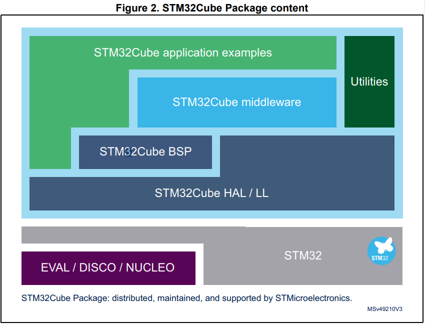

# 嵌入式软件架构规范


## 1 概述

### 特性	

​	架构设计是嵌入式开发的重要一环，一个优雅的架构具有以下特性：

1. 能够使软硬件最大程度协同工作，具有一定的鲁棒性；
2. 各功能模块尽可能独立，低耦合、高内聚、可复用；
3. 逻辑清晰，数据流向明确；
4. 接口完善，便于移植等。

### 原则

​	实现层次架构后，软件设计应遵循以下基本原则：

1. 同一层次的模块相互独立，不允许相互调用；
2. 自顶向下，各层模块依次调用下层接口实现自身功能，不允许跨层调用；
3. 新增的接口、任务、模组、设备等模块应与原有架构保持统一；
4. 引入操作系统后，任务调度和数据传递均应基于操作系统机制进行，任务内逻辑则通过逐层调用下层接口实现；
5. 对中断和以中断形式传输的数据进行恰当的处理，进行并发控制，保证线程（任务）安全；尽量避免全局变量的使用。

### 架构一览

​	战队嵌入式软件架构框图如下，各块的详细说明见 `2 结构层级 `。

![[Architecture]swerve_v0.3.drawio](嵌入式软件架构规范.assets/[Architecture]swerve_v0.3.drawio.png)

​** 该架构目前尚不成熟，暂未在队内推广，还需要进一步的测试、验证、修订。**


## 2 嵌入式系统架构层级

战队的电控工作依赖 STM32CubeMX 生成初始化项目，其中 STM32Cube Package 架构如下：



STM32CubeMX 将基于此架构生成项目。

​在此基础上，结合 DJI 自动驾驶域控制器架构，经过一定的修正，形成战队电控架构规范。


### 2.1 硬件层（Hardware Layer）

​硬件层包含位于嵌入式板上的所有主要物理组件及其接口。

#### 硬件抽象层（Hardware Abstraction Layer）

​HAL 是对硬件的抽象和封装，提供了统一的硬件设备访问接口。HAL 涉及的各层级 STM32 片内外设包括 GPIO、TIM、IWDG、USART、SPI、CAN、I2C...

> STM32Cube HAL 为此提供了支持，请直接使用。

### 2.2 系统软件层（System Software Layer）

​嵌入式软件可以分为两大类：系统软件和应用软件。系统软件是支持应用程序的任何软件，例如驱动程序、操作系统和中间件。

#### 板级支持包（Board Support Package）

​BSP 是进一步调用 HAL 的各种方法实现硬件配置、外设初始化、功能聚合等，从而为 STM32 片内硬件实现的上层可直接调用的功能支持包。上层模块调用板级支持包提供的接口，而无需关注 HAL 库及其他底层细节。在应用时，BSP 仅与对应外设自身功能相关，该层对数据的描述不具有特定含义。

> 若使用 STM32CubeMX 生成项目，部分外设配置相关的 BSP 将自动生成；其他部分由队员编写而成，是战队电控的通用底层接口。

#### 操作系统（Operating System）

​嵌入式系统对实时性要求较高，采用实时操作系统（Real Time Operating System）。战队选用 FreeRTOS 进行开发。

> STM32Cube Packge 将 RTOS 内核组件定义在 Middleware 层级，在此不做改动。

​在架构图中，操作系统与任务的关系用紫色虚线框加以描述。RTOS 的核心功能如下：


#### 中间件（Middleware）

​一般而言，中间件软件是任何不是操作系统内核、外设驱动程序或应用程序的系统软件。为便于区分系统软件和与机器人开发相关的软件，机器人抽象组件（如实用工具、独立设备驱动、算法等）和抽象模组将被定义到应用软件层，但它们严格意义上也属于中间件，允许任务重用。

​在本架构中，中间件包括：

* RTOS 内核；
* 已经包含在现成支持包中的应用软件，如 USB 应用支持；
* 第三方供应商提供的现成软件（ *.lib 等）；
* 用户自定义的杂项设置（如设备列表、条件编译开关定义等）;
* 队内编写的数据、通信服务组件（基于 RTOS ）等。

> 若使用 STM32CubeMX 生成项目，FreeRTOS 和 USB 支持将自动添加至 Middleware 目录。

### 2.3 应用软件层（Application Software Layer）

​应用软件是定义嵌入式设备的功能和用途并处理交互的上层软件。

#### 组件（Component）

​组件是一些独立模块，在嵌入式系统中发挥功能但不与其他模块耦合。

* **实用工具（Utility）**

* **设备驱动（Device Driver）：**

设备是组成机器人的最小单元，包括电机、遥控系统、裁判系统等等单一独立模块。设备驱动程序对实体设备进行抽象，管理更高层软件对设备的访问。每个设备驱动对应一组 `.c/.h` 文件，内容主要包括：

* 设备初始化程序；
* 设备通信接口；
* 设备数据解析接口等。

> 设备驱动程序基于 BSP，是战队电控的通用底层接口，各兵种可各自实现特有的设备驱动。

* **算法（Algorithm）：**

算法区别于实体，作为抽象的功能模块存在于架构中。每个算法对应一组 `.c/.h` 文件。

> 算法模块是战队电控的通用底层接口，各兵种可各自实现特有的算法。

#### 模组（Module）

模组是组成机器人的具有一定聚合关系的实体组件集合或抽象模块，如云台、底盘、错误检测器等，彼此独立、耦合度低。模组驱动对为任务提供应用接口。每个模组驱动对应一组 `.c/.h` 文件。

> 大部分模组驱动由各兵种各自实现，可复用的模组应当协作完成；错误检测结构体已经确定，方法由兵种各自实现。

#### 任务 / 线程（Task / Thread）

​任务依赖于系统软件，由系统软件管理和调度。任务描述该嵌入式系统最高级的目的，简介清晰地展示运行过程，并与用户进行了大部分交互；除此之外还有一些系统必要的任务，如错误处理任务、消息处理任务、调试任务等。

> 大部分任务 / 线程由各兵种各自实现。错误检测和处理、消息处理、调试等任务框架已经确定，具体细节由各兵种各自实现。


（以下尚未基于 RTOS 做修订）

------

## 3 数据和消息

### 3.1 数据结构与存储

* 单一模块使用的数据封装于含有模块名字或模块功能名称的结构体中；
* 自顶向下，结构体按照模块调用关系依次包含，说明如下：
  * `TLL`定义单一任务数据结构体，结构体内包含调用的`API`接口模块下定义的各接口数据；
  * `API`定义单一接口数据结构体，结构体内包含调用的`FML`功能模块内定义的各模块数据；可定义仅与接口功能实现相关的私有变量；
  * `FML`将需要向上层传递的数据封装入功能模块数据结构体中（或以返回函数值的形式传递，具体见下节）；在功能模块内部定义私有变量，存储通信过程中的原始数据及其他仅与功能实现相关，但与任务或任务间消息传递无关的数据。
* 在`TLL`对`API`提供的抽象数据类型进行实现，所有数据存储于`TLL`。
* `debug`相关文件中定义便于调试观察的全局变量。

### 3.2 数据流与处理过程

#### 自顶向下

* `TLL`定义了所有实体数据，由该层向`API`传递变量指针；通过接口函数形参的`const`关键字，限制接口函数对数据的读写权限；
* `API`继续向`FML`函数传递所需的变量指针，并限制功能模块的读写权限；
* `FML`处理底层私有数据，此类数据通常来源于*中断*。

#### 自底向上

* `FML`处理完成后，当`API`调用相关方法时，将需要向上层传递的数据写入给出的地址，此类数据主要包含通信过程中的原始数据和经过初步解析得到的设备层级能够描述的数据；
* `API`继续向上层传递数据，此类数据主要包含与接口功能相关的任务执行所需数据；
* `TLL`各任务汇总与该任务有关的全部数据，给出获取实体数据指针的接口；
* 系统函数在任务调度的过程中，调用`TLL`给出的接口以获取该任务的消息，以传递指针的形式实现任务间数据流转；传入其他任务时保证数据只读。

#### 中间层处理


### 3.3 任务间通信


### 3.4 来自中断的数据


### 3.5 内存管理


### 3.6 调试数据

* `debug`相关文件中调用`TLL`给出的接口，给定义好的全局变量赋值，以便于用户调试观察。


## 4 初始化

* 将所有初始化过程封装于系统初始化函数中，在`main.c`中调用；
* 系统初始化函数自底向上调用以下各层级初始化函数：

  * 板级支持层级初始化，针对多个设备通用的外设支持，如PWM初始化、CAN驱动初始化等，通常实现于`BSP`层的用户实现的`bsp_xxx.c/h`中；

  * 设备初始化，针对单一设备的硬件初始化和底层内部数据初始化，通常实现于`FML`层的相关文件中；
  * 算法初始化，针对算法所需的初始数据定义，通常实现于`FML`层的相关文件中；
  * 应用层级初始化，针对任务相关数据、调用的接口函数数据等与底层功能无关的应用数据，通常实现于`TLL`的相关文件中，由`TLL`调用`API`的相关数据初始化接口。
* 完成所有初始化后，启动主任务时钟。


## 5 任务调度


## 6 中断管理

* 在系统初始化过程中启动相关底层传输中断；
* 主任务时钟将按照设定的频率产生中断；

### 中断回调

* 所有对中断的处理实现于中断回调函数中，该类函数由HAL库给出弱定义，可由用户在任意位置重新自定义，HAL库将在中断触发后调用对应中断回调函数。相关函数声明可参考HAL库源码或文档；
* 在主任务定时器中断回调函数中，调用任务调度函数；
* 在其他中断回调函数中，应尽可能简单地进行底层初步处理，只留下必要的数据处理和重置操作等，以避免中断对主程序周期执行的不良影响。对于数据的解析、与上层逻辑有关的操作等，均应移至任务中实现。


## 7 错误检测和处理


### Config.h

#### 主要内容和功能

* 基础类型定义；
* 外设硬件接口定义；
* 各组件、模块等条件编译宏定义开关；
* 机器人组件工作模式类型定义；

#### 说明

* 出于可移植性的考虑，在config文件中定义外设接口，以便于概览和修改。同时应包含外设接口对应的头文件，如

```c
#include "tim.h"

#define HTIM_CONTROL   htim6
```

* 条件编译宏定义开关定义形式为`#define USE_XX 0`或 `#define USE_XX 1`；
* 机器人组件工作模式枚举类型按照优先级顺序定义，`0`对应最低优先级；


## 附录

### 版本说明

| 版本号                                                  | 发布日期 | 说明                   | 贡献者 |
| ------------------------------------------------------- | -------- | ---------------------- | ------ |
|  | 2022.09  | 预发布，适用于裸机架构 | 薛东来 |
|  | 2022.11  | 适用于RTOS架构         | 薛东来 |

### 参考资料

[1] Tammy Noerga, Embedded Systems Architecture - A Comprehensive Guide for Engineers and Programmers.

[2] [Development guidelines for STM32Cube Expansion Packages](https://www.st.com/resource/en/user_manual/um2285-development-guidelines-for-stm32cube-expansion-packages-stmicroelectronics.pdf).

[3] [Mastering the FreeRTOS Real Time Kernel - A Hands-On Tutorial Guide](https://www.freertos.org/fr-content-src/uploads/2018/07/161204_Mastering_the_FreeRTOS_Real_Time_Kernel-A_Hands-On_Tutorial_Guide.pdf).

